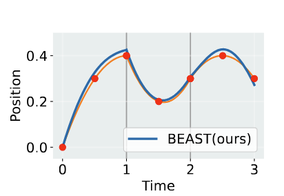

# Frontier of General-Purpose Robotics (2025): Research, Data, and Evolving Industry Dynamics

**Sourish Jasti, Vrishin Patel, Adam Patni**

---

## Scope

Robotics has entered a period of rapid acceleration with advances compounding faster than at any point in the last decade. However, unlike deep learning, which could ride on internet-scale data and standardized hardware, robotics must learn on the true distribution of the physical world, making its progress harder won. In this deep dive, we take stock of the frontier: the technical innovations, engineering constraints, and strategic paths now defining the race toward general-purpose robots.

We’ll assume the fundamentals of robotics (perception, planning, control, generalization, etc.) are understood; readers who want a detailed history of those can find an excellent existing breakdown [here](https://github.com/adam-maj/robotics?tab=readme-ov-file).

---

## Table of Contents

- [1) Architectures & Systems](#1-architectures--systems)
  - [1.1 Hierarchical Generalist Policies](#11-hierarchical-generalist-policies)
  - [1.2 Action Tokenization, Decoders, Controllers](#12-action-tokenization-decoders-controllers)
- [2) Data & Evaluation](#2-data--evaluation)
  - [2.1 Evals & Benchmarks](#21-evals--benchmarks)
  - [2.2 Physics-Driven Simulators](#22-physics-driven-simulators)
  - [2.3 World Models](#23-world-models)
  - [2.4 Collecting and Scaling Real World Data](#24-collecting-and-scaling-real-world-data)
- [3) Industry Dynamics](#3-industry-dynamics)
  - [3.1 Deployment Setting](#31-deployment-setting)
  - [3.2 Model Strategy](#32-model-strategy)
  - [3.3 Form Factor](#33-form-factor)
- [4) Resources + Paper Notes](#4-resources--notes)

---

## 1) Architectures & Systems

The opportunity to build generalized robots arose from parallel developments in deep learning and language models. The earliest attempts at building these were architectural - smashing together language queries and low-level pre-trained robotic policies. As the field has evolved, we’ve seen these architectures become more specialized and end-to-end, focusing on taking sensor inputs and translating them into robotic actions. In 2025, a variety of labs and companies use hierarchical generalist policies that split into a “thinker” for high-level reasoning for long-horizon tasks and a fast low-level controller for smooth, reactive movement.

In the race to generalized robots, research and engineering are tightly coupled. The best robots are a function of model intelligence (planning, generalizability), but also systems integrity (hardware reliability, end-to-end latency, controls). We care about how well these robots operate in the real-world, not their performance on synthetic benchmarks or test-coverage in simulated environments.

> “This false nomenclature of “researcher” and “engineer”, which is a thinly-masked way of describing a two-tier engineering system, is being deleted from @xAI today. There are only engineers. Researcher is a relic term from academia.” - [Elon](https://x.com/elonmusk/status/1950254103474446728)

Engineering efficient systems around these models is now essential to realizing the performance gains promised by greater generality and flexibility in robotic planning. Progress is constrained by persistent bottlenecks: high perception–action latency, safe and precise manipulation with human-like dexterity, and the need for better training recipes, datasets, and base models.

> “A large part of Robot Learning is systems research, but it doesn't quite fit the existing paradigms: think of CoRL, RSS, SOSP, and MLSys. It draws from all but is inherently full-stack --- hardware, control, compute, ml algos.” - [DanFei Xu](https://x.com/danfei_xu/status/1954406907437006956)

While hierarchical models represent important progress, they don't address the complete set of challenges we face in scaling generalized robots. Even the most sophisticated model becomes nearly useless for the vast majority of real-world tasks if it suffers from high latency or intractable data collection/hardware costs. In the latter half of this section we ask ourselves the question: What are the non-neogtiables even if we do solve robotic intelligence?

---

### 1.1 Hierarchical Generalist Policies

_**Robotics adopts a two-brain architecture**_

In the first few months of 2025, publicly published papers in general-purpose robotics show a push towards hierarchical generalist policy: a high-level “thinker” for reasoning and planning, paired with a low-level controller tuned for rapid, smooth execution. This dual-system approach is inspired by [Daniel Kahneman’s famous research on human cognition](https://en.wikipedia.org/wiki/Thinking,_Fast_and_Slow) and separating slow reasoning from time-critical control made cross-embodiment practical.

Multiple frontier labs were simultaneously working on the new paradigm and demonstrated zero and few-shot manipulation for ~5-minute chores (tightening bottle caps, bagging Legos, opening doors) at ≥50 Hz.


Building on [π0](https://www.physicalintelligence.company/download/pi0.pdf)’s cross-embodiment breakthrough, Physical Intelligence’s [HiRobot](https://arxiv.org/abs/2502.19417) advanced the approach with hierarchical policies in [π0.5](https://www.physicalintelligence.company/download/pi05.pdf); meanwhile, DeepMind’s [Gemini Robotics](https://storage.googleapis.com/deepmind-media/gemini-robotics/Gemini-Robotics-1-5-Tech-Report.pdf) adapted Gemini 2.0, and humanoid systems began translating this template into tangible capability through parallel efforts from  NVIDIA’s Isaac [GR00T](https://developer.nvidia.com/isaac/gr00t) and [GR00T N1.5](https://github.com/NVIDIA/Isaac-GR00T), [Figure’s Helix](https://www.figure.ai/news/helix) (in [logistics](https://www.figure.ai/news/helix-logistics)), and [1X’s Redwood](https://www.1x.tech/discover/redwood-ai) (in domestic trials). (FYI: checkout RoboArena for a benchmark across a bunch of the new policies).

_**π0 shows the first glimpse of ‘do what I mean’**_

We’ve tracked the evolution of model architectures through Physical Intelligence’s open-source releases, though labs are competing neck and neck. Pre-π0, a dishwasher-loading policy trained in one kitchen often failed in a separate Airbnb kitchen because the sink may have been on the other side and the drawer handles were different. Every new environment forced expensive recollection and retuning. Asked to “clear the table,” a VLA like π0 could interpret the scene, understand the objects present, pick up plates, and find a nearby surface it hadn’t seen during training. That’s the first glimpse of “do what I mean” rather than “replay what I’ve seen,” but it could still stumble on stiff handles, novel objects outside its demo distribution, and real-time instructions.

_**HiRobot layers planning on top of action**_

HiRobot broke past π0’s limits by layering a high-level VLM planner on top of π0’s VLA policy and showed that augmenting training with synthetic prompts and corrections are crucial. This let a robot adapt in real time to constraints like remaking a sandwich mid-step when a user said “no pickles, I’m allergic.”

_**From adapting inside homes to generalizing in unseen environments by co-training on heterogeneous data**_

But HiRobot’s strength was still narrow: it excelled at adapting within familiar environments, not generalizing to wholly new ones. In π0.5, for the first time, a robot could enter an unseen home and clean a kitchen or make a bed from a single high-level command. By co-training on heterogeneous data (e.g. robot demos across embodiments, high-level semantic subtask labels, web image–language corpora, and verbal instructions), the model internalized both scene semantics and control priors. This allowed behaviors like “bring me a peach” when demos only ever showed apples: web data supplies the concept of “peach,” cross-embodiment data teaches many ways hands can grasp, and the diffusion action head makes wrist-level motions reliable at speed. And the ablations make the point vivid: without multi-environment or cross-embodiment data, π0.5 fails at basic household tasks, showing that heterogeneity, more than sheer robot hours, is the key to open-world generalization.

<p align="center" width="100%">
    
</p>

_Based on conversations with research engineers, there is also significant development of tightly fused VLAs for task-specific robots. Tightly fused implies that vision, language, and action are jointly trained – meaning there is not necessarily a separate language or vision backbone._

> **TAKEAWAY:** In 2025, many labs have publicly experimented with hierarchical, cross-embodied policies with efficient action communication, scaling faster as datasets diversify. The open questions became about limits. The next step is to examine the mechanisms that turn these high-level strategies into smooth, real-world robot actions.

---

### 1.2 Action Tokenization, Decoders, Controllers

As hierarchical policies became the dominant design for general-purpose robots, attention turned to action tokenization, the “handshake” between the high-level planner and the on-robot controller.

_**Action tokenizers unlock robotic transformers**_

Transformer architectures excel at predicting the next word in a sequence, but robots move in continuous space and time. To enable robotic transformers to operate on action data, trajectories from demonstrations must be split into action tokens, which are compact codes that represent motion primitives. These tokens are transmitted, decoded, and turned into smooth actuator commands by the on-robot controller. Tokenization directly sets the limits for latency (how quickly the robot reacts), control frequency (how often it updates its movements), and smoothness (how natural those movements look and feel).

_**Latency limits productization**_

Current frontier performance thresholds highlight both progress and constraint. Gemini Robotics runs at ~250 ms latency and 50 Hz control, which is enough for structured tasks but too slow for fine, reactive manipulation. Consumer-grade dexterity, as Eric Jang emphasized in his “[Ultra Instinct](https://evjang.com/2025/07/27/ultra-instinct.html)” framing, requires sub-50 ms reaction times to be safe and natural in human-facing settings. The gap widens when planning runs in the cloud, where any network problem halts control entirely. This is why efforts like Gemini’s on-device variant and 1X Redwood’s fully local loop are important: they trade reasoning depth with reaction speed, a key trade-off that defines the next wave of deployment. The fastest policies we’ve seen across the industry have been deployed by [Generalist](https://generalistai.com/), a group of former Deepmind researchers that have shown dextrous manipulation at 100Hz for various industrial grade sorting tasks.
```
+------------------------+----------------------------------+------------------+
| Use Case               | Algorithms                       | Latency Bound    |
+------------------------+----------------------------------+------------------+
| Dextrous manipulation  | VLA, tokenizers, low-level       | 10–50 ms         |
|                        | control policies                 |                  |
+------------------------+----------------------------------+------------------+
| Swarm robotics         | Multi-agent planning,            | 10–50 ms         |
|                        | distributed control              |                  |
+------------------------+----------------------------------+------------------+
| Mobile navigation      | Visual SLAM, local planning,     | 50–100 ms        |
|                        | obstacle avoidance               |                  |
+------------------------+----------------------------------+------------------+
| Human teleoperation    | MPC, control loops, haptics      | <100 ms          |
+------------------------+----------------------------------+------------------+

```
Against this backdrop, recent advances in tokenization methods have begun to shape the practical ceiling for responsiveness. The latest in this category builds on work from the [Action Chunking Transformer](https://arxiv.org/pdf/2304.13705) (ACT), which showed that predicting several actions at once as opposed to a single next action could smooth movements and accelerate control loops.

_**Improving tokenizers for fine-grained control**_

But even with ACT, dexterity often breaks down at the level of fine motions. Imagine two nearly identical wrist movements: one rotates a screwdriver just enough to bite into the screw, while the other, off by only a few degrees, slips uselessly against the head. In ACT’s latent space, these two motions may be encoded so similarly that the policy fails to learn the difference. Because the model is autoregressive (feeding its last output back in as input) it often learns to simply repeat the previous action rather than adjust to the subtle variation required for success. The loss function barely penalizes the model for treating the motions as the same, but in practice that neglect is catastrophic for tasks like screwdriver turning, cable insertion, or any action where a tiny trajectory shift separates success from failure. [FAST](https://www.physicalintelligence.company/research/fast) addresses this limitation by taking inspiration from JPEG compression techniques to create a novel way to discretize action tokens so that critical distinctions in motion are preserved instead of collapsed.

<div style="display: flex; justify-content: space-between; align-items: flex-start; gap: 8px;">
  
  
</div>
<p align="center"><em> Trajectory comparison between ACT (left) and BEAST (right) tokenizers. </em></p>

Tokenizers like FAST and ACT don’t enforce trajectory smoothness across sequential tokens, meaning that their outputs might be discontinuous and produce jerky motions. For example, in the ACT graph, the chunking strategy follows the red curve well within the time step of a single token, but at the boundary it drops sharply instead of continuing forward. [BEAST](https://arxiv.org/abs/2506.06072) solves these jerky jumps by producing B-spline tokens, which are continuous curves that bridge token boundaries, resulting in smooth, consistent actions.

Other teams combined traditional motion-planning tricks with these chunking methods, or shrank models so they could run entirely on the robot itself.  Tokenization is the bandwidth/codec of motor intent; better codes beat bigger planners when the loop must run fast.

> **TAKEAWAY:** We’ve learned that smarter action codes, like FAST’s compressed frequency tokens and BEAST’s spline chunks, can buy better fine-grained control and smoother motion profiles. But the milestone is still ahead: on-device sub-50 ms loops that make robots feel coordinated and natural in human spaces.

---

## 2) Data & Evaluation

> “Show me the data, and I’ll show you the outcome” should be the mantra of any enterprising robotics company. Andrej Karpathy was known to have postponed model development efforts in favor of waiting a few weeks for the next batch of labeled data to solve Autopilot problems.

Compared to LLMs where labs could essentially download the internet’s corpus of text, robotics training data is multimodal, meaning it includes language, audio, vision, push/pull/twist forces, joint angles (shoulder, elbow, wrist), and trajectories (manipulator position over time). Given the number of vectors, robotics data is neither easy to collect nor is it organized in an easily downloadable archive. Additionally, only a handful of signals provide the diversity required to improve models.

Every path to robotic intelligence runs through the problem of data... how to generate enough of it, how to measure progress against it, and how to make it diverse enough to reflect reality. Synthetic pipelines (e.g. simulators, world models) promise scale, but risk drifting from the physical world; real-world collection grounds learning, but is slow and expensive; evaluation gives the compass, but is still evolving. The field’s challenge (and opportunity) is weaving these together into a self-reinforcing system where robots learn not just from repetition, but from a deliberately engineered stream of diverse, evaluable experience.

---

### 2.1 Evals & Benchmarks

_**Evals as ‘steering wheels’**_

An evaluation is the yardstick we use to judge a robot’s ability: the task setup, the scoring system, and the feedback loop that shows whether one policy outperforms another. But evals are more than a scoreboard—they act as a steering wheel, directing research and even entire organizations. Poorly chosen metrics can obscure promising models, while strong ones provide a global marker to optimize around. [SWE-bench and agentic coding](https://x.com/willdepue/status/1963739518554489250) are great examples.

_**Benchmarking traditional robots is easier than general-purpose**_

Past evaluations were deterministic (e.g. did the arm weld, cut, or hit throughput?). Today’s general-purpose tasks hinge on fuzzier qualities (e.g. did the grasp hold, did the motion look confident). Early efforts assumed that if a VLA benchmarked well, and an action head benchmarked well, the combined robot would too. In practice, optimizing pieces in isolation didn’t yield strong systems and you actually needed to benchmark the entire stack.

_**Strong individual components fail without system-level validation**_

This exposed the gap between model-level evals, which test a single component in repeatable isolation and system-level evals, which measure how the whole robot performs in context. A dishwasher-loading task isn’t just “detect the cup”; it requires sequencing (e.g. “open door, grasp handle, rotate wrist”), physical reasoning (“don’t spill water”), and adaptation to clutter. Success or failure emerges only after dozens of steps, making it harder to reduce to a single metric. Researchers often resort to watching rollouts and describing behaviors in natural language, a process that is slow, expensive, and especially burdensome for high-level tasks like laundry folding or dishwashing, where differences only emerge after long rollouts.

_**Learned observers automate evaluation at massive scale**_

To address this scalability challenge, several companies now deploy learned observers, specialized VLA models trained to evaluate policy performance and determine task completion. These evaluators can automatically compute success metrics, identify failure patterns, and even help robots recover from novel failure states by triggering appropriate reset procedures. This means that observers and robots can be running 24/7 and with thousands of pieces of hardware, so the bottleneck is not on humans. Every company guards these system evaluation metrics, as they’re a core component of what differentiates a company and drives engineering output. The result is that each company has its own yardstick, making it hard for the broader field to compare progress on shared footing.

_**Labs came together to create crowdsourced benchmarks**_

This lack of standardization led to new frameworks like [RoboArena](https://arxiv.org/html/2506.18123v1), which replaces rigid scoring with crowdsourced A/B evals. At one lab, an evaluator might set up a cluttered kitchen and ask both Policy A and Policy B to “place the red cup in the sink,” then record a progress score, a preference, and a short note like “Policy A grasped confidently while Policy B hesitated”; at another, the task might be “push the stapler into the drawer,” with the evaluator judging which policy moved more smoothly. The system then accounts for task difficulty and policy–task interactions to turn thousands of these noisy trials into a fair leaderboard. Afterward, VLMs tag the evaluation videos with labels such as “pick-and-place in a cluttered kitchen,” while LLMs digest evaluator notes across trials into structured reports highlighting strengths and weaknesses with references to specific episodes. To keep the system sustainable, labs earn evaluation credits wherein every A/B evaluation they contribute gives them credits to test their own policies.

---

### 2.2 Physics-Driven Simulators

_**Real-world data is finite, thus environments matter**_

In robotics, painstaking data collection and annotation methods are still the norm. As the Skild team said, “a simple back of envelope math says that even if the whole population of earth collects data it will take years to reach 100 trillion trajectories.” Faced with this reality, researchers are shifting their focus toward building environments that let robots actually act, fail, and improve through interaction. An environment is where learning happens (e.g. the physical lab setups, the simulated task suites, the high-capex sensor rigs that only frontier labs can afford).

Virtual physics-based environments are appealing because they have the potential to scale data limitlessly and in novel scenarios with deterministic models of the laws that govern our world. However, building high-definition simulators is just one step towards generalized synthetic data curation for training robotic foundation models. They must also be cost effective, run quickly, and create realistic representations for robotic sensing modalities.

_**Simulated success often collapses on real hardware**_

We've all seen hundreds of videos of robots learning to walk in simulation, but then immediately falling over when deployed on real hardware. The robot stumbles because its center of mass shifts differently than predicted, and its foot strikes rough pavement instead of the smooth simulated floor it trained on. We can attribute this to the minute differences between what physics-simulators predict and the actual forces a robot experiences in the real world.

_**Two strategies to close Sim2Real gap: higher fidelity vs. error correction**_

Resolving this failure mode has led to two distinct camps in the sim2real community. Most teams are focused on training models to measure and correct for the sim2real gap. Others are focused on making simulators even more realistic with higher fidelity physical representations.

_**Error correction between sim and reality beats chasing ‘perfect’ simulation**_

Most general-purpose simulators have historically leaned on measuring every quirk of the robot (its weight balance, motor torque, friction, etc.) to hand-tune the simulator to reality and intentionally shaking up those numbers (like friction or lighting) so the robot learns to handle messy variations. [ASAP](https://agile.human2humanoid.com/) instead teaches the policy to account for the simulator’s blind spots. It trains an error correction model that learns the differences between simulated dynamics and real-world behavior captured through video observations. Rather than chasing a perfect simulator, it’s like giving the robot a built-in sense for when the “map” doesn’t match the “terrain”—if it stumbles on an unexpected surface, ASAP anticipates the slip and adjusts its steps in real time.

_**Generalization at scale demands automating reward functions**_

Once you can train a single policy in simulation, generalization depends on two factors: simulation diversity and scalable reward functions. The target is tens of thousands of simultaneous robots performing varied tasks, but at this scale, human-in-the-loop reward assignment becomes impossible. [Sim2Real RL for Vision-Based Dexterous Manipulation](https://toruowo.github.io/recipe/) created a method to guide robots without human intervention. The robot gets simple “grab here” hints, like virtual stickers on the object in simulation. With these, it learns to handle items even if they’re a new shape or weight. It uses two camera views: one to spot where the object is, and another to understand its shape. By teaching the robot “what makes a good grasp” (contact markers) and “how to see objects” (hybrid camera views), it can generalize to pack whatever you put in front of it.

_**Predicting physical properties is critical for simulating complex interactions**_

For robots to operate in unstructured environments, they need simulators that understand how different materials behave. A sponge compresses under pressure while a mug shatters if gripped too tightly. As humans we can intuitively understand an object's tactile response from our eyes alone. Simulators, on the other hand, must identify these properties computationally and incorporate them into physics-based models. On a factory floor with very specific tool-pieces and end-effectors, it was straightforward to manually specify these material properties in simulation. As robots aim to generalize to new domains, it becomes intractable to catalog this data for unseen objects.

[Pixie](https://pixie-3d.github.io/) addresses this bottleneck by predicting physical properties from visual input alone. The model was trained on over 1,600 synthetic objects to recognize material characteristics like density, elasticity, and friction coefficients by analyzing an object's appearance. Despite training only on synthetic data, Pixie successfully generalizes to real-world objects demonstrating that visual cues like surface texture, transparency, and structural patterns contain reliable information about physical characteristics. This data is used to run simulations that analyze how different objects respond to robotic grasping in a realistic manner.

_**Scaling simulation requires faster computation**_

Simulators like MuJoCo or Isaac handle physics-heavy problems like walking or balancing, but they’re bogged down on vision. Physics is just math (e.g. forces, collisions, gravity) but vision requires rendering photorealistic camera images, which is far more expensive. That’s why training robots to “see” and act in cluttered settings is painfully slow and memory-hungry. [ManiSkill3](https://arxiv.org/html/2410.00425v2) found ways to make vision-based training fast and cheap. Its breakthrough was cutting out the overhead between physics and graphics, keeping both on the GPU, and designing an API that can spin up many diverse scenes at once without wasting memory, ultimately reaching up to 30,000 frames per second (like giving a robot the experience of playing thousands of practice chess games every minute instead of one game at a time). Just as important, each parallel world can be different: different rooms, objects, or lighting, giving robots the variety they need to generalize.

> **Takeaway:** Simulation has evolved from a research tool to a core data engine for robotics, but its success depends on mastering three challenges: bridging the sim-to-real gap, automating reward functions at scale, and making vision-based training computationally efficient enough to compete with real-world data collection.

---

### 2.3 World Models

_**World models help robots imagine diverse scenarios**_

A world model, by contrast, is the robot’s imagination: an internal simulator that compresses what it has seen in environments into a latent space, and then runs controllable rollouts cheaply in its own “head.” If we return to the chess analogy, environments are the board itself, multiplied thousands of times over, where robots can practice real moves. World models are the player’s imagination, thinking several moves ahead without needing to touch the board. The implication is that environments can become powerful data engines, pumping out millions of diverse training examples. World models will later complement this by letting robots imagine, not just act.


<p align="center"><em>GAIA-2 generates synthetic multi-camera data for out-of-distribution scenarios like swerving offroad.</em></p>

_**Synthetic environments enable controllable rare-event training**_

Wayve’s [GAIA-2](https://wayve.ai/thinking/gaia-2/) for example, uses a controllable, multi-camera video world model to simulate everything from routine traffic to rare, safety-critical events (e.g. dangerous overtakes, sudden pedestrian crossings, extreme weather) in diverse geographies like the UK, US, and Germany. Engineers can not only create brand-new driving scenes but also take real driving logs and change conditions while keeping the scene semantics intact, filling in a long tail of scenarios without sending a car back on the road. For example, they can take a single driving scenario and systematically vary individual elements, like switching pedestrians from wearing dark coats to bright raincoats, while keeping everything else constant. This capability enables two critical advances: 1) precise controllability over physical world parameters for targeted testing, and 2) systematic model evaluation across different environmental factors by isolating specific variables that might affect driving performance.


<p align="center"><em>Genie 3 can persist painting on wall actions over long time horizons.</em></p>

_**Interactive virtual worlds extend horizons, but lack control**_

[Genie 3](https://deepmind.google/discover/blog/genie-3-a-new-frontier-for-world-models/) by Deepmind demonstrated a huge leap in real-time interactivity. Given just a text prompt, it can generate rich, navigable worlds (e.g. natural landscapes, historical settings, and fantastical realms) and runs live at 24 fps. It keeps environments physically and visually consistent for minutes at a time and supports “promptable events” like making it rain or spawning a portal mid-session.

Before Genie 3, [Genie 2](https://deepmind.google/discover/blog/genie-2-a-large-scale-foundation-world-model/) was state of the art for simulating virtual worlds - namely video games and supporting custom actions like walking, jumping, and swimming. These worlds could persist for about 60 seconds, meaning that training long-horizon policies was untenable for robotics use cases. As a latent diffusion model, Genie 2's action space is learned rather than explicitly programmed, which means we lack deterministic control over agents; they might spontaneously decide to perform parkour when we intended them to snowboard. This non-deterministic behavior persists in Genie 3 and remains a significant barrier to translating these simulations into effective real-world robot policies.

Although there is not a technical release on Genie 3, we can infer some of the future research directions that they will take to support embodied agents, including adding support for robot-specific actions (over arrow keys), and adding support for the simulation of other independent agents in the environment. These are important for robotic foundation model progress because without them, our robots will have learned to live in a physics conditioned, but actor-free world, leading to failures when interacting with the messiness of humans!

_**Internet-scale video pretraining slashes robotics data needs**_

[V-JEPA](https://arxiv.org/html/2506.09985v1) by Meta took a different approach to world models. Instead of trying to build a simulation environment for robots, they attempt to encode the world itself into the pre-training phase. Meta demonstrates that you can pretrain a latent action-condition world model over a million hours of broad, curated internet video, then add just 62 hours of unlabeled robot interaction data, and get a model that can plan and execute manipulation tasks in entirely new environments.

> **TAKEAWAY:** These papers show that most of an agent’s “experience” can come from observation of synthetic scenarios, with only a small amount of targeted interaction needed before deployment. It’s a shift that could lower the cost of entering new, high-value domains, and a step toward seeing robotics come alive in the everyday world.

---

### 2.4 Collecting and Scaling Real World Data

While simulators and world models promise infinite data, the physical world remains the ultimate benchmark. However, real-world data is notoriously sparse, expensive, and difficult to collect at scale. A key research problem is how to collect and scale data using novel methods or hybrid approaches that combine teleoperation and simulation. Researchers are not relying on a single method, but are developing a portfolio of strategies to source new data, enhance existing datasets, and redefine what "quality" data means in the first place.

_**Brute forcing scale with industrial tele-operation pipelines**_


The most straightforward strategy for scaling data collection is industrial-grade teleoperation. This approach is similar to how companies like Scale AI / Mercor / Surge provide data labeling as a service – and there are a host of companies which do this for robotics. It involves capturing vast amounts of human-operated robot actions, often through VR or joystick setups. Tesla's Optimus program is a prime example of this philosophy in action, relying on a [massive pipeline of human-teleoperated data](https://x.com/shreyasgite/status/1960612577169293708) to bootstrap its core manipulation capabilities. While effective for gathering volume, this approach still requires significant investment in hardware and operator time.

Teleoperation breaks down on real-world tasks because operators lack force feedback and most hardware doesn’t match the exact way humans move (as heard in [Dwarkesh’s LabelBox ad](https://x.com/i/status/1966564191164072408), “it’s a bit harder than I anticipated”). This mismatch makes demonstrations slow, error-prone, and biased, while also limiting the diversity of tasks that can be shown. Thus, data pipelines are also bottlenecked at the hardware layer, where small design choices (like whether fingers can spread, feel contact forces, or use fingernails) decide whether you can even capture the right kind of manipulation data at scale.

_**Fidelity improves with perioperation, when humans and robots move together**_


[DEXOP](https://arxiv.org/pdf/2509.04441) introduces perioperation, which involves collecting robot training data by having a person wearing an exoskeleton that mirrors their hand movements onto a robot hand, so the human feels the force and the system records the motion and touch data. By designing the exoskeleton and robot hand, they produced more useful data per unit of time and higher-quality policies than tele-op.

_**Humans can be sensors themselves via egocentric data collection**_


A more advanced variant of this is the "human-as-sensor" model, which aims for higher-fidelity data. Instead of just recording joystick commands, companies like [Mecha](https://www.mecha.company/) use smart glasses ([EgoZero](https://egozero-robot.github.io/)) and tactile gloves (Feel the Force) to capture data directly from human sight and sensation, enabling a more nuanced and direct transfer of skills.

_**Augmenting datasets after collection**_

An alternative to collecting data is to enhance the value of an existing dataset. This approach focuses on improving data quality and diversity post-collection, without needing to deploy more robots or hire more operators.

In this vein, [DiffusionRL](https://arxiv.org/pdf/2505.18876) takes an existing dataset and uses reinforcement learning to enrich it, adding more of the nuance of human hand movements. This allows it to achieve high success rates on complex tasks by "upgrading" a limited dataset, effectively getting more value from the initial collection effort.

_**Failure cases in robotics is valuable for success**_

Unlike language models –where degenerate outputs are not useful– in robotics they are essential for learned recovery. Valuable data for building resilient and dextrous systems also comes from failure, recovery, and other "messy" real-world interactions.


<p align="center">
  
  
</p>
<p align="center"><em>Mimic-one: Failures in data collection are advantageous for dexterity performance in real-world failure cases.</em></p>

[Mimic-one](https://arxiv.org/html/2506.11916v1) proved this by building a training recipe around staged failures. By deliberately showing a robot a "careless" grab before a correct one, the policy learned to adapt and re-orient objects, a critical skill that perfect demonstrations would never teach.


<p align="center"><em>Dex1B simulated hands</em></p>

_**Engineering dexterity at a billion-scale**_

[Dex1B](https://arxiv.org/html/2506.17198v1#bib.bib23) offered an approach which both used imperfect data and augmented it to new heights. The study started with a seed dataset of 5M lifting and articulation hand trajectories, which were embedded with atomic skills that were rich in imperfection like recovery and re-orientation. While this was a strong initial dataset, they had to solve for scale. Typically, generative models create instances that aren’t physically plausible or stick close to examples they were previously trained on. The authors incorporated geometric constraints to ensure that the generated demonstrations was realistic. Then, to solve the data diversity problem they introduced a debiasing mechanism that prioritized generating demonstrations under less common conditions, pushing the model beyond the familiar territory of the seed data. This dual approach, which promoted feasibility and diversity, enabled Dex1B to scale up to 1B high-quality, varied demonstrations, setting a new benchmark for dexterous manipulation datasets.


<p align="center"><em>As seen in Table 1, even the largest of prior datasets in this space had ~1000x less demonstrations. Dex1B’s model, DexSimple, achieved a 22% performance increase over previous best methods and demonstrates that scaling laws are still in order for many corners that will be core to robotics.</em></p>


This offers a potent lesson for the wider field. Given that dexterity remains a major constraint in applied robotics, especially due to the scarcity of high-quality data, the success of Dex1B highlights a promising approach that could be transferable to other domains facing similar challenges.

> **TAKEAWAY:** The shift we've seen isn't a single "2025 breakthrough," but a new methodology where data is an engineered asset. The idea of a billion-scale dataset was largely theoretical. We're now focused on intelligently creating and refining data. This includes algorithmically upgrading existing datasets, generating vast amounts of new, physically-plausible examples, and ensuring the diversity needed for robots to handle the unpredictability of the real world.

There have been advancements in tele-ops, perioperation, augmenting datasets, sim, and scaling data. The throughput at which companies can collect data is key for engineering future developments. Industry players have each taken different approaches to the data problem. The training recipe is still uncertain, and while we have capabilities to scale data, we are still unsure what is the right thing to scale.

Advances in tele-operation, peri-operation, augmentation, simulation, and data scaling have accelerated progress. Yet the central constraint is still throughput—the rate at which companies can collect data. Each industry player has taken a different path to solving this problem, reflecting a lack of consensus. The debate on the right training recipe is unsettled, so while our ability to scale data has grown, it is not yet clear which axis is most important.

---

## 3) Industry Dynamics

In the past 12 months, we’ve seen a surge in capital, demos, and technical results in humanoids, large-scale model releases, and vertical robotics-as-a-service builders, as well as new entrants in both hardware and AI architectures. VCs have been publishing their theses too ([Robotics Won’t Have a ChatGPT Moment](https://www.coatue.com/blog/perspective/robotics-wont-have-a-chatgpt-moment) by Coatue, [The Robotics Breakout Moment](https://salesforceventures.com/perspectives/the-robotics-breakout-moment/) and [Salesforce Ventures Guide to Investing in Robotics](https://salesforceventures.com/perspectives/salesforce-ventures-guide-to-investing-in-robotics/) by Salesforce Ventures, [The Age of Embodied Intelligence](https://www.luxcapital.com/news/the-age-of-embodied-intelligence-why-the-future-of-robotics-is-morphology-agnostic) by Lux Capital, etc.)

Our framework for classifying robotics companies consists of three axes:

1) **Deployment strategy** (industrial or consumer)
2) **Model training strategy** (foundation model or fine-tuning)
3) **Physical embodiment** (humanoid, cobot, or animal-analog)

These labels are by no means mutually exclusive (i.e. a company can serve both industrial settings and consumers), but for the sake of organization, it is helpful to segment them.

---

### 3.1 Deployment Setting

The go-to-market for a robotics company defines how they think about building their business (who they hire, how they brand, how much they focus on sales, etc.). Broadly, this can be separated into focusing on either consumer or industrial settings. This also informs engineering strategy - data diversity, hardware resiliency, and generalization needs are all a function of where the robot is deployed.

**Consumer:** _1X, K-Scale, Hugging Face, The Bot Company, Matic_

The broadest market of all is everyday users. History suggests this is where generational companies emerge—Apple with personal computing, Facebook with social networks, OpenAI with chat. The first company to embed itself in daily life wins scale, distribution, and cultural lock-in.

The largest pool of untapped human labor sits in household tasks (e.g. laundry, cooking, cleaning, car care) representing billions of hours annually. Just as the washing machine collapsed laundry, which was once an all-day chore, into a two-hour cycle with the push of a button, consumer robotics promises to compress and automate other repetitive tasks.

The uphill battles are immense. Reliability and safety thresholds. Environments are highly variable and robots will have to contend with messy kitchens, small apartments, children, and pets. Unlike an enterprise sale, unit economics demand both affordable hardware and service models that scale, while trust requires flawless design and seamless human–robot interaction. The challenge is building a generalizable stack robust enough for everyday messiness, yet cost-efficient enough for mass adoption.

**Industrial:** _Tesla Optimus, Figure, Persona, Neura, Apptronik, Gecko Robotics, Locus Robotics, Watney Robotics, Lucid Bots, Formic, Asylon Robotics, Knightscope_

Industrial robotics today splits into two camps. On one side, companies like Gecko Robotics, Locus Robotics, Lucid Bots, Formic, Asylon, Knightscope, and Watney pursue the verticalized robotics-as-a-service model. Their edge comes from tight integration of hardware, software, and service contracts in a plethora of specific domains such as cleaning, construction, energy & utilities, agriculture, security & defense, industrial automation, warehouse & logistics, etc. The early deployments focus on observing and reporting—inspection as the entry point—but the trajectory pushes steadily toward remediation, where robots must act on the environment with higher autonomy and tighter control loops.

Running in parallel are the generalist efforts: Tesla with Optimus, Figure, Persona, Neura, and Apptronik. These companies are not just building robots for a single vertical but positioning themselves as foundation-model labs for embodiment. Their bet is that control stacks trained at scale can generalize across embodiments and domains, allowing them to capture the platform layer of robotics in the same way that OpenAI or Anthropic aim to dominate language and multimodal AI.

---

### 3.2 Model Strategy

**Foundation Model Labs:** _DeepMind, Physical Intelligence, Skild, WorldLabs, Genesis, Generalist, Dyna, Field, Figure, 1X, RLWRLD, Covariant, General Robotics_

These labs are focused on the research bottleneck: building the largest and most general-purpose models. The product for foundation model companies is likely the API – access to a capital-intensive, broadly applicable frontier model that application-layer robotics companies can adapt to their own workflows. While open-weight releases like Physical Intelligence’s π0 / π0.5 as well as NVIDIA’s GR00T N1 lower the entry point for application companies, without comparable datasets and hardware pipelines, smaller teams still struggle to reproduce frontier results.

The barriers here are steep. Training a cross-embodiment policy demands fleets of diverse robots, months of teleoperation or autonomous deployment for data collection, and large-scale compute to train multi-billion parameter models. Only well-capitalized players with deep funding, in-house hardware pipelines, and access to low-cost compute can realistically compete.

Assuming the funding environment stays as rich as it was for LLMs (which is plausible given the size of the potential pie), these companies are likely to follow the same trajectory frontier LLMs did: concentrating around a few players with the scale to train once and distribute broadly.

Some labs may also experiment with “[model-as-the-product](https://vintagedata.org/blog/posts/model-is-the-product)” strategies. For example, it may be more efficient to buy an unoptimized business with few existing robotics solutions and architect the full process from scratch, rather than “fine-tuning” existing processes around legacy systems.

The likely industry structure is a small set of foundation labs at the center, with application-layer companies at the edge building customer-facing products. In between, we expect acquihire-heavy consolidation led by those with the most resources and lowest cost of compute (Google, NVIDIA, perhaps Tesla), as larger platforms absorb specialized robotics teams to secure talent and proprietary deployment data.

**Fine-tuning**

As application-layer robotics companies scale, the limits of building models entirely in-house become clear and they will be pushed toward a hybrid stack: generalist policies from larger labs as the baseline, fine-tuned with proprietary deployment data and compliance workflows. In this regime, RaaS ((robotics-as-a-service) players act as API customers but still defend their edge through the data they generate, the integrations they control, and the service guarantees they provide. The loop is mutually reinforcing—verticals contribute failure-rich datasets from the field, while foundation labs deliver models that unlock broader scope and higher reliability. The result is a market structure where full-stack aspirants and vertical operators depend on each other: the former need breadth of deployment data, the latter need scalable baselines to move from inspection to remediation. The unresolved question is which layer captures more value: the foundation-model providers seeking to be the core platform vs. the vertical operators entrenched in customer intimacy, compliance, and uptime.

In industrial settings, these robots operate with a RaaS model charging fixed monthly/yearly fees for autonomous solutions. In the consumer markets, robots are tasked with helping out around the home or office to perform basic tasks for a similar fee structure, albeit much cheaper hardware. There's also an emerging prosumer market, akin to early personal computing days, where companies build infrastructure for semi-technical users to take existing hardware and train specific tasks on their own data.

---

### 3.3 Form Factor

There are several form factors that a robotics company can deploy to achieve its goal.

<div style="display: flex; justify-content: space-between; align-items: flex-start; gap: 8px;">
  
  
  
</div>


#### Humanoid

Humanoid companies argue that a single human-like form factor can eventually operate across many labor environments without requiring custom hardware. Since most spaces are designed for human operators, humanoids appear to maximize the “option value” of deployment. In practice, however, this framing glosses over the realities of specific business cases. Take warehousing: the sector already has a competitive field of specialized robots, each tuned to a narrow slice of the workflow from picking arms to mobile conveyors to autonomous forklifts. For a humanoid to justify its place, it would need not only to match or exceed the performance of each of these specialized solutions, but also integrate seamlessly into existing warehouse systems and processes.

Each player seems to emphasize a different early-stage path: Tesla treats Optimus as a long-term extension of its vertically integrated AI + manufacturing stack; Figure pursues early logistics and manufacturing tasks as beachheads; Agility and Apptronik differentiate on modularity and cost profile; Fauna and 1X explores humanoids for homes and shared spaces.

#### Cobots

If humanoids are a Swiss Army knife, cobots (aka collaborative robots) are a screwdriver: cheap, precise, and designed for the actual job at hand. They thrive where tasks are semi-repetitive and environments are controlled, like small factories and logistics centers stacking boxes. Universal Robots alone has >100K units in the field, a signal that “good enough, safely, and today” has had room to run before “fully general someday.”

Cobots are quick to set up, built with force-limited joints and optional sensors that let them work safely alongside people without safety cages. Their tradeoff is that they’re limited in payload and often slow, but a growing ecosystem of software and vision tools is extending their reach—simulation platforms let tasks be modeled and optimized offline before deployment, while real-time perception upgrades give cobots the ability to adapt to moving or imperfect parts.

#### Animal-Analog

Animal-inspired robots are built for environments that wheels or arms cannot access. They are designed for settings where mobility and morphology are the main constraints, such as rubble, tunnels, or narrow industrial channels.

Quadrupeds have, for example, seen early commercial success. Energy Robotics uses Boston Dynamics’ Spot to patrol oil rigs, nuclear plants, and construction sites; Ghost Robotics’ Vision 60 has been tested by the U.S. military for reconnaissance and perimeter security; Anybotics’ ANYmal inspects tunnels, mines, and offshore platforms. Fire departments deploy them for bomb disposal or hazardous-material scouting, and construction firms use them to capture daily 3D scans of sites.

Snake-like robots are another example. In industry, they are used for pipeline inspection in energy infrastructure, sewer maintenance, and even medical research for minimally invasive surgery.

However, there are tradeoffs. Quadrupeds rarely lift more than 10–20 kg, drain batteries far faster than wheeled systems, and cost $70K–$150K, making them expensive inspection platforms rather than general-purpose workers. Snake robots can reach confined spaces but move slowly and are mechanically fragile.

---

## 4) Resources & Notes

Below is a curated set of research papers, blog posts, and interviews that capture the state and trajectory of general-purpose robotics. For select works, you’ll also find links to our internal notes.

---

### **Vision-Language-Action (VLA) Policies**
- **π0**: [paper](http://physicalintelligence.company/download/pi0.pdf)
- **HiRobot**: [paper](https://arxiv.org/abs/2502.19417), [notes](paper_notes/hirobot.md)
- **π0.5**: [paper](https://www.physicalintelligence.company/download/pi05.pdf), [notes](paper_notes/pi5.md)
- **Gemini Robotics**: [paper](https://arxiv.org/html/2503.20020v1), [notes](paper_notes/gemini.md)
- **NVIDIA Isaac GR00T**: [paper](https://arxiv.org/abs/2503.14734)
- **NVIDIA Isaac GR00T N1.5**: [repo](https://github.com/NVIDIA/Isaac-GR00T)
- **Figure Helix**: [page](https://www.figure.ai/news/helix)
- **1X Redwood**: [page](https://www.1x.tech/discover/redwood-ai)

### **Action Tokenization, Decoders & Controllers**
- **Action Chunking Transformer (ACT)**: [paper](https://arxiv.org/pdf/2304.13705), [notes](paper_notes/act.md)
- **FAST**: [paper](https://arxiv.org/pdf/2501.09747), [notes](paper_notes/fast.md)
- **BEAST**: [paper](https://arxiv.org/pdf/2506.06072), [notes](paper_notes/beast.md)
- **SAIL**: [paper](https://arxiv.org/abs/2506.11948), [notes](paper_notes/sail.md)

### **Evals & Benchmarks**
- **RoboArena**: [paper](https://arxiv.org/pdf/2506.18123), [notes](paper_notes/roboarena.md)
- **RoboEval**: [paper](https://arxiv.org/pdf/2507.00435), [notes](paper_notes/roboeval.md)

### **Physics-Driven Simulators**
- **ASAP**: [paper](https://arxiv.org/pdf/2502.01143), [notes](paper_notes/asap.md)
- **Sim2Real RL for Vision-Based Dexterous Models**: [paper](https://arxiv.org/pdf/2502.20396), [notes](paper_notes/sim2realrl.md)
- **Pixie**: [paper](https://www.arxiv.org/pdf/2508.17437), [notes](paper_notes/pixie.md)
- **ManiSkill3**: [paper](https://arxiv.org/pdf/2410.00425), [notes](paper_notes/maniskill3.md)

### **World Models**
- **GAIA-2**: [paper](https://arxiv.org/pdf/2503.20523), [notes](paper_notes/gaia2.md)
- **Genie 2**: [blog](https://deepmind.google/discover/blog/genie-2-a-large-scale-foundation-world-model/)
- **Genie 3**: [blog](https://deepmind.google/discover/blog/genie-3-a-new-frontier-for-world-models/)
- **V-JEPA 2**: [paper](https://arxiv.org/html/2506.09985v1), [notes](paper_notes/vjepa2.md)


### **Data (Collection, Scaling)**
- **DEXOP**: [paper](https://arxiv.org/pdf/2509.04441), [notes](paper_notes/dexop.md)
- **DiffusionRL**: [paper](https://arxiv.org/pdf/2505.18876), [notes](paper_notes/diffusionrl.md)
- **Mimic-one**: [paper](https://arxiv.org/pdf/2506.11916), [notes](paper_notes/mimic-one.md)
- **Dex1B**: [paper](https://arxiv.org/pdf/2506.17198), [notes](paper_notes/dex1b.md)

### **Other Recommended Writeups, Blogs, & Podcasts**
- **Adam Maj’s robotics deep dive**: [repo](https://github.com/adam-maj/robotics)
- **Eric Jang’s robotics and autonomy blog**: [blog](https://evjang.com/)
- **Vintage Data: Industry analysis/blog**: [blog](https://vintagedata.org/blog/)
- **Rohit Bandaru’s blog**: [blog](https://rohitbandaru.github.io/blog/)
- **Sergey Levine × Dwarkesh Patel** (Interview): [link](https://www.dwarkesh.com/p/sergey-levine)
- **Karol Hausman & Danny Dreiss × Jacob Effron** (Podcast): [link](https://open.spotify.com/episode/6uMMsBbqnE5UNjwZAV443N)
- **Thomas Wolf × Sonya Huang & Pat Grady** (Podcast): [link](https://www.sequoiacap.com/podcast/training-data-thomas-wolf/)
- **Fei-Fei Li × Sarah Guo & Elad Gil** (YouTube): [link](https://www.youtube.com/watch?v=C6Zm5S7JHMw)
- **Sergey Levine × Sam Charrington (TWIML Podcast, π0)**: [link](https://twimlai.com/podcast/twimlai/%cf%800-a-foundation-model-for-robotics/)

---