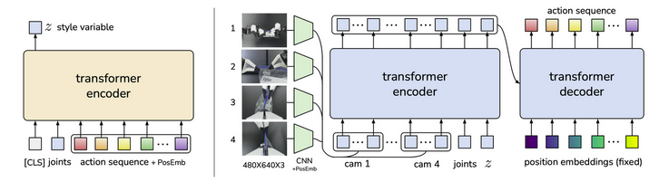

**Arxiv**: https://arxiv.org/pdf/2304.13705  
**Link**: https://tonyzhaozh.github.io/aloha/  

**The Challenge:** 
- Early imitation models predicted actions one frame at a time, causing jitter and loss of temporal coherence.
- This limited their ability to perform long, contact-rich manipulation directly from demonstration data.

**The Solution:** 
- ACT, Action Chunking with Transformers, predicts multi-step action chunks instead of single commands.
- Denoising short time steps of motion lets the model achieve smooth, consistent control directly from demonstration data.
- Instead of predicting a single action (like “move the gripper 1 cm”), the policy predicts an entire trajectory segment (eg “reach toward the block and start closing the gripper”).

**The Technical Details:**

- **The Recipe:**
  - Collect demos via teleoperation and label each success/failure.
  - Teleoperator intentionally introduces failures.
  - Train a UNet diffusion policy on proprioception.
  - Run the trained policy on the robot; log where it fails (missed grasp, misalignment, object slip).
  - Set the robot into those failure states and collect self-correction demonstrations showing recovery motions.
  - Retrain the policy including these correction episodes to teach recovery behavior.
  - Deploy the final policy at 15 Hz inference with continuous action sampling and observe emergent smoothness and re-grasping.
- **Training the Diffusion policy:**
  - Pretrain the perception encoder and train the UNet diffusion head end to end on real trajectories.
  - Inputs: 2-frame observation; proprioception + RGB from 3 cameras.
  - Actions: Relative Cartesian poses + joint angles.
  - Loss: Denoising MSE between predicted and ground truth action chunks.

**Interesting Finds**
- Self-correction data increased task success by 26-33% across benchmarks (bread pick, bottle sort, battery insert).
- 1:1% increase of dataset size to success rate.
- Ablations show all recipe elements are critical. The removal of relative actions, diversity, or correction drops success to 5-56%.

**Limitations**
- Relies on teleoperator skill and real hardware access.
- Manual data collection and labeling remain costly.
- Policies are hardware specific and lack tactile sensing.
- Evaluations are single task rather than multi ask generalization.

