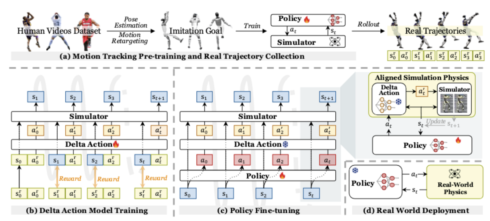

**Arxiv**: https://arxiv.org/abs/2502.01143  
**Link**: https://agile.human2humanoid.com/  

**The Challenge:**  
- Solve full-body humanoid dynamics leveraging a simulation environment while compensating for the sim2real discrepancy

**The Solution:**  
- This paper proposes a recipe in which you compensate for sim2real delta by learning the dynamics of the real-world with a residual model and using it to re-train your policy in a simulator with these dynamics

**The Technical Details:**

The Recipe:
1. Train a policy in simulation 
2. Run policy on real robot + measure what the robot did vs what the same policy in simulation would do
    - Requires a motion capture system (multiple cameras to capture joint positions)
3. Train a residual model that understands this delta (real-world dynamics)
4. Fine tune the policy on robot with this residual model 
5. Deploy final policy onto robot

**Training the RL policy**
- Pretrain on human videos with a retargeting to the 3d poses
- Reward function: weighted sum of 
    - Joint / torque limit penalties
    - Feet orientation/heading (ensure feet are parallel)
    - Mean error of body position, rotation, and velocities (primary task)

**Interesting Finds**
- The author notes that in open-loop control increasing the training horizons from .25s -> 1.5s improves performance (mean joint position error), but this same trend does not hold for closed-loop control (1.0s is the best).

**Limitations**
- Hardware gets destroyed quickly in testing due to motor overheating - 2 Unitree G1’s were destroyed in producing these results
- Motion capture systems require painstaking setup 

