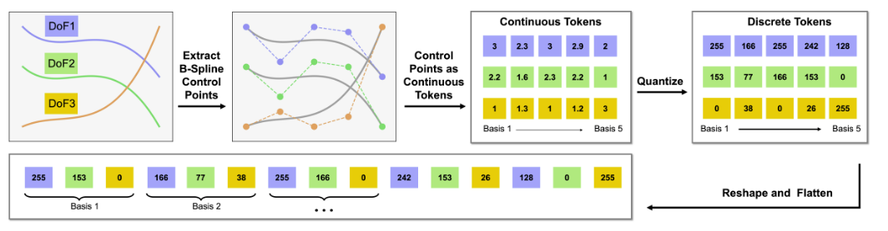
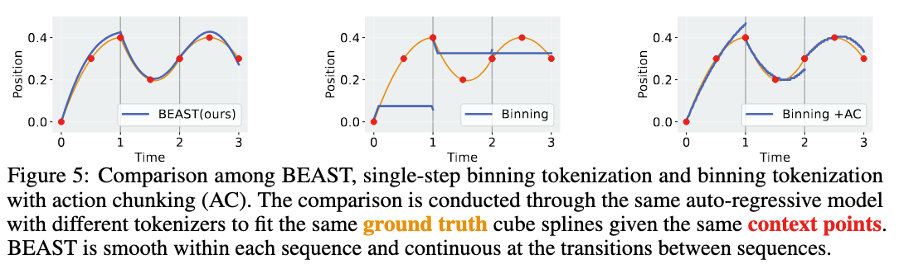
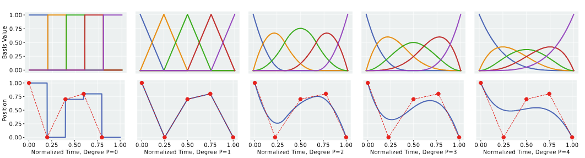

**Arxiv**: https://arxiv.org/abs/2506.06072  
**Link**: https://intuitive-robots.github.io/beast_website/

**The Challenge:**
- Action tokenization, condensing continuous robot actions,  is integral to modern imitation learning and VLA models, but tokenizers are limited.
- Tokenizing allows robot control to work with sequence models (like transformers or VLAs) by enabling them to predict and generate action sequences efficiently, like how language models generate words.
- Tokenization methods either:
  - Discretize every single action step
    - inefficient for high-frequency control
  - Compress action sequences with learned tokenizers (like byte pair encoding), which introduce training overhead and produce variable-length tokens.
- These approaches make inference slow and choppy/discontinuous, leading to jerky motion, high computational cost, and leads to bad scalability for robotic control.

**The Solution:**
- BEAST is a mathematically cool and resource inexpensive way to tokenize by representing action sequences as B-splines.
- This results in smooth and fixed-length tokens without needing to train a model to tokenize actions.
- To summarize:
  - Each trajectory is estimated by a set of control points (found via linregr) 
  - Clamped B-splines connect the points
  - Another win is that BEAST supports both discrete and continuous tokens so its compatible with large VLA’s and small transformers.

**Interesting Finds**
- “To ensure smooth transitions, we directly set the first control point c0 to the last action of the previous sequence” - this is funny! To ensure that the actions are continuous they force the next B-spline to use the current B-spline's last control point.

**Limitations**
- Extremely sensitive to B-spline; too few and it underfits the control points, too many and compression benefits disappear. 

