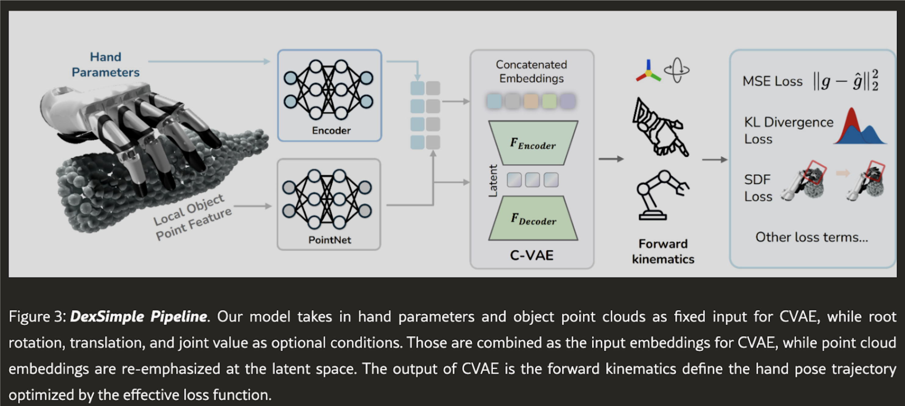
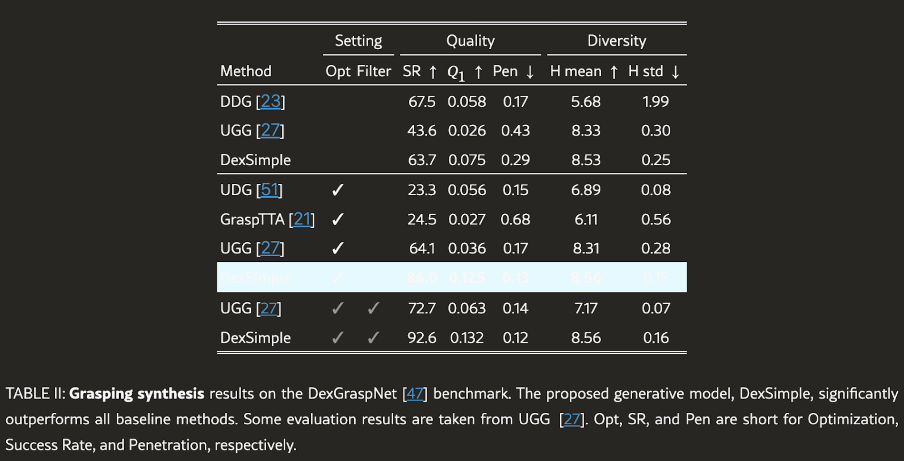

**Arxiv**: https://arxiv.org/html/2506.17198v1#bib.bib23  
**Link**: https://jianglongye.com/dex1b/  

**The Challenge:**  
- Generative models often suffer w/ feasibility (generate bad samples like fingers floating in the air or poking through an object) and limited diversity (make known grasps instead of inventing new ones).
- The big question of the paper is how do I avoid inheriting biases and make it realistic on a variety of dimensions.

**The Solution:**  
- Dex1B creates a very tiny and quality seed dataset (5M hand poses) using optimization techniques. Then it uses a generator to make 1B data points.
- Fixes feasibility afterwards.
- After the model generates a hand pose—say, with the middle fingertip accidentally poking 1 cm into the object at and the pinky joint bent beyond its 90° limit—they fix it by running a quick clean-up step that nudges the hand just enough to stop the poke, adjust the contact point to bring all joints back into safe angles, using a loss function that balances how close the fingers are to the object, how much they penetrate, and whether they collide with themselves or violate joint limits.
- Fixes diversity by counting how many grasps exist for each type and prefer new samples that are less seen.
- This process is iteratively done on the dataset.

**The Technical Details:**  
- Optimization is doing gradient loss for each pose to find the optimal way forward even when a robot doesn’t have any other info on the situation (solving).
- Generative modeling is learning to dream up good poses after seeing enough examples (learning).
- They minimize a loss function that balances different goals for a hand between grasping and articulation tasks.
- The refined hand poses are then optimized via a physics simulator.
- “We…demonstrate that incorporating an SDF-based geometric constraint during training enables it to outperform state-of-the-art methods by a large margin.”
- “We also empirically find that training with the point-sphere SDF loss is more stable compared to the mesh-sphere SDF loss used in the optimization stage. With this SDF loss term, our proposed DexSimple outperforms SOTA methods by a large margin”
- “It is worth noting the success rate of DexSimple without post-optimization and filtering is slightly lower than that of DDG [23]; this is expected as our method is a generative model while DDG [23] is a regression model, and our method achieves much higher diversity”

**Interesting Finds**  
- “While both tasks benefit from larger datasets, lifting requires a more extensive dataset to achieve stable performance, whereas articulation maintains reasonable performance even with less data.”

**Limitations**  
- This is open-loop, meaning there is no feedback during execution / correction mid task if something goes wrong.
- Very vulnerable to errors. (Robot sees something wrong, an object slips or moves, robot misses the contact point by a bit it’ll just act like it grabbed the object like it did in sim).
- If the robot thinks a banana is straight (from simulation), but it’s bent in real life, it might reach and totally miss.
- If the hand lands slightly beside a drawer handle, it still pulls — even though it grabbed nothing.
- Generating grasp samples is quite fast but every sample needs to be tested in simulation to see if it actually works. Running sim trials for millions of tasks to find which ones succeed is expensive.
- Model is trained with scenes of just one object. It doesn’t understand cluttered environments.

