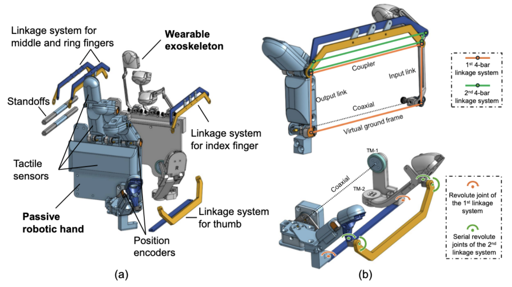

**Arxiv**: https://arxiv.org/html/2509.04441v2  
**Link**: https://dex-op.github.io/  

**The Challenge:**  
- There’s debate around whether resistive tactile sensors (found on tactil gloves) provide rich enough data  
- High fidelity tactile sensors are rigid and bulky for humans to wear so they impair natural dexterity  
- Making Data Collection Natural (high force transparency + kinematic coupling between human hand and robot hand  
- “Sensorizing” human manipulation is the idea to collect data from tactile operation, explored in Feel-the-Force, but is constrained by human-robot hand differences, light sensors are too low-resolution, and good sensors are too bulky/rigid for dextrous tasks.  

**The Solution:**  
- Construct devices a human can wear and record data during their manipulation, instead of remotely controlling a robot  
    - Passive robotic hand which interacts with objects and wearable exoskeleton for the human hand  
- “perioperation: sensorizing human manipulation to capture rich multisensory data, including vision, proprioception, touch, and action, while maximizing the transferability of the demonstrated skills to robots.”  
- Advantages: 
    - Data collection is natural  
    - Uses a whole hand tactile sensing system  

**The Technical Details:**  

- Two components: 1) passive robot hand that interacts with objects 2) wearable exoskeleton connected via linkage system  
- One metric the authors measured was data collection throughput - they find that DEXOP produces higher throughput (~2-10x) on collection tasks from an operator perspective  

**Interesting Finds**  
- Adding fingernails allowed it to pick objects with shallow profile and manipulate small objects (like screw caps). A padded palm secures objects more firmly  
- “Replaying the joint position is insufficient for recreating the amount of the force the robot needs to exert. The missing information is the torque exerted by each joint.” <- this is why integrating tactile sensors was key for training downstream policies  
- By separating the human hand from robot hand, DEXOP enables the passive and actual hand  

**Limitations**  
- Must use DEXOP design - doesn't scale to the current widespread arms in use (YAM, Unitree Z1, etc)  
- “Perioperation systems are sensitive to manufacturing defects in the exoskeleton and to sensor calibration. … In thisi paper we compensated for such errors by incorporating teleoperation data”  
- EyeSight hand is missing some degrees of freedom that a human hand has  
- “current DEXOP system provides proprioceptive feedback but still misses the tactile feedback to human” <- humans can see the hand and visualize it as their own, but do not feel the response from grasping objects  
