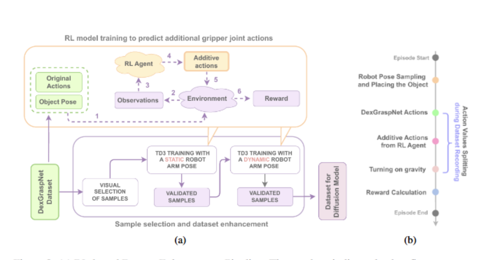

**Arxiv**: https://arxiv.org/pdf/2505.18876 

**The Challenge:** 
- Dexterity manipulation for robots is an extremely difficult challenge because of compounding complexities of its subproblems.
- Hardware: The ideal form factor of a dextrous limb is a hand, which requires building out a robotic limb that can embody each DoF of a human hand
- Data: lacks nuance necessary for a robot to understand the subtle motions/corrections that humans do to perform a task smoothly/recover from an error
- Built out datasets are mostly image-only corpora lacking any way for a model to learn detail/nuance 

**The Solution:** 
- DiffusionRL tackles the data issue by augmenting the DexGraspNet dataset using reinforcement learning to create nuanced data 
- Then a diffusion model is trained on the high quality dataset to 

**The Technical Details:**

**Interesting Finds**
- The RL agent is able to enhance the dataset by visually excluding inappropriate samples. Then, it was trained to predict additional actions on certain, valid, poses
- The resulting dataset was high quality enough that it showed promising results in simulation.

**Limitations**
- No real-world tests, all were done in simulation - might be an issue with this.
