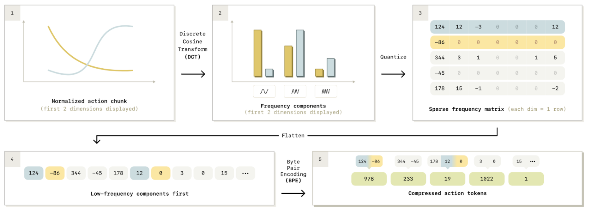
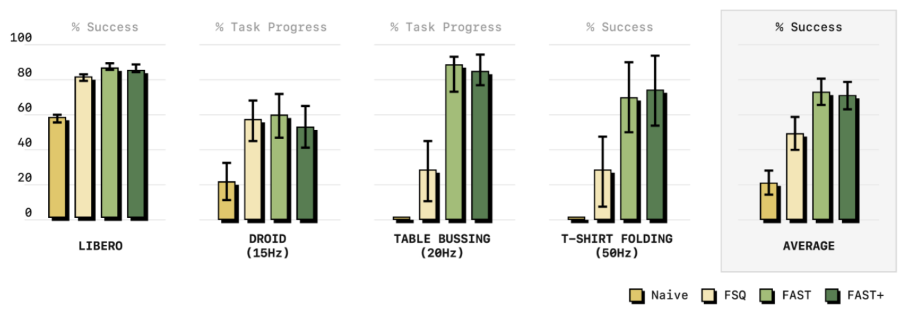

**Arxiv**: https://arxiv.org/abs/2501.09747  
**Link**: https://www.pi.website/research/fast  

**The Challenge:**  
- Current methods for representing actions via discrete binning are either insufficient or extremely time intensive to train

**The Solution:**  
- “We propose FAST, a simple yet effective approach for tokenization of robot action trajectories via time-series compression.”
- “Our key insight is that robot action signals need to be compressed before training, to reduce correlation between consecutive tokens”

**The Technical Details:**  
- Needed to find a tokenization strategy that operated on continuous signals while also reducing the correlation between consecutive tokens. 
    - Intuition is that action1 and action2 might be very close to each other representationally (e.g. cosine distance between embeddings), so differentiating between them is very difficult for a model to learn, especially if the loss isn’t drastically changed by switching between the two.

- DCT encoding is commonly used to compress continuous signals - so the authors implement it to encode these continuous actions.
- Intuition is that we can decompose any chunk of actions into a series of cosine waves at various frequencies. Changes in some high-frequency component of motion will yield a large change in the resulting DCT decomposition, thus making the tokens more responsive to fine-grained changes.
- Another added benefit of the DCT matrix is that it can be approximated sparsely (so motions can be compressed efficiently)
- Trained on 1M 1-second action chunks from multiple embodiments (single-arm, bi-manual, mobile manipulation)

**Interesting Finds**  
- The authors note that the ordering of how they represent the DCT token (low-frequency first vs high-frequency first) impacts the performance of the resulting policy. They found that having low-frequency components first was better.

- Performance is significantly better

**Limitations**  
- FAST is slower at inference time than diffusion action heads on pi0, but it is much faster to train.
