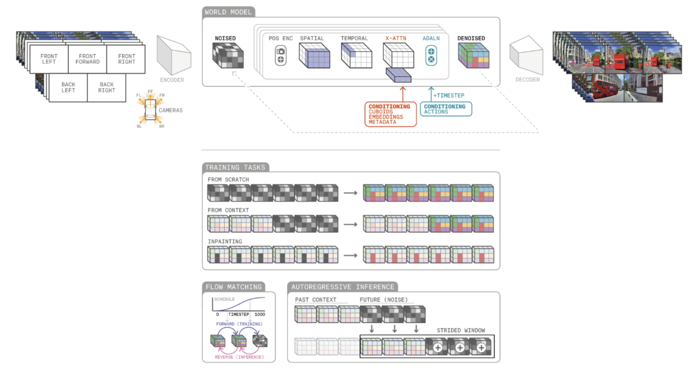

**Arxiv**: https://arxiv.org/abs/2503.20523  
**Link**: https://wayve.ai/thinking/gaia-2/

**The Challenge:**
- Generate realistic and controllable rollouts for autonomous vehicles with pixel-level reconstruction detail.

**The Solution:**
- GAIA-2 consists of two components 
  - a video tokenizer/encoder that translates a series of frames into a latent representation
  - a world model that predicts future states of the latent representation conditioned on actions, control signals, and CLIP embeddings. 
- The video decoder is novel because it maintains spatio-temporal consistency across multiple camera views. 

**The Technical Details:**

- Synchronized images are passed into an encoder model, which along with a latent embedding can decode into a series of rolled out future timesteps in diverse scenarios
- The primary loss function is on perceptual quality, L1/L2 reconstruction, and DINO distillation on latent features (video/text)

**Interesting Finds:**
- The key differences between GAIA-1 and GAIA-2 are that GAIA-2 uses a continuous latent-space representation over a discrete one, and the added ability to condition on language embeddings. This enabled controlling the scene environment via text and images, and also improved visual fidelity of generated videos. 
- “In contrast to most latent diffusion models, GAIA-2 employs a much higher spatial compression rate (e.g., 32× vs. the more typical 8×), which is offset by increasing the channel dimension of the latent space (e.g., 64 channels instead of 16)” - this enables faster inference and better memory utilization given the increased number of viewpoints
- Dynamic Agent rollouts are enforced via a 3D bounding box detector -> this is like an enforced architectural bias onto the world model

**Limitations**
- Occasional temporal/spatial inconsistencies (normal across world models)
- Computationally intensive - does not run real-time (bottleneck on speed/cost of throughput)
- Integration of human agents/social interactions are not modeled with respect to driving behavior
