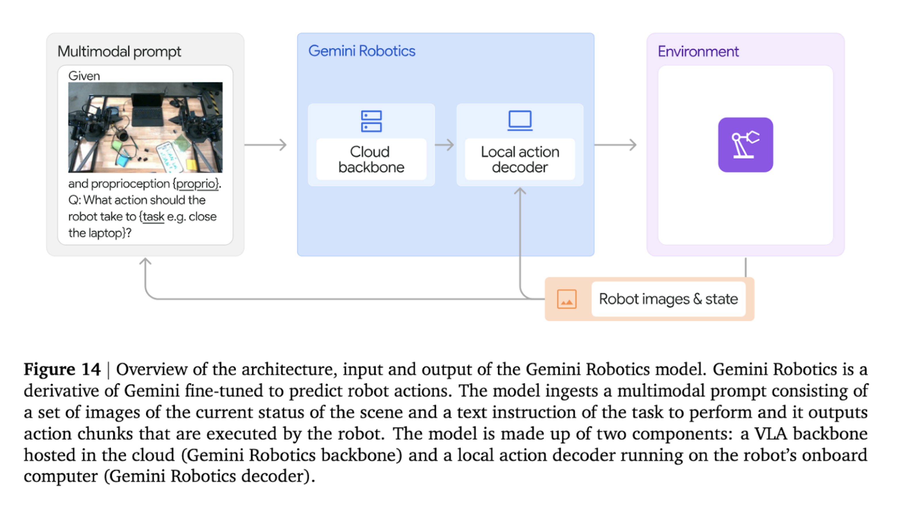
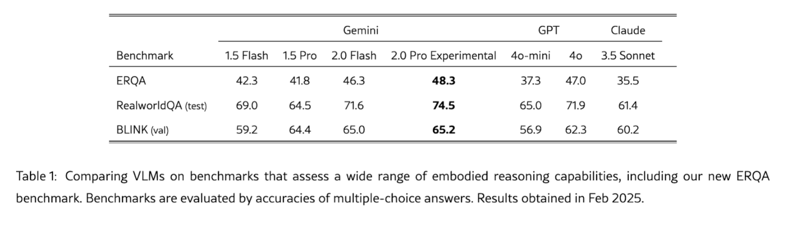
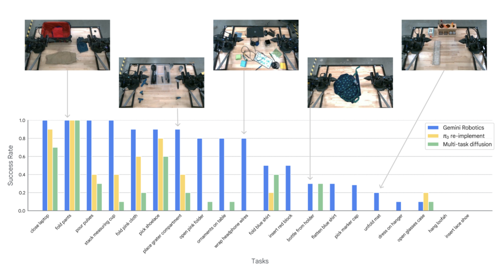

**Arxiv**: https://arxiv.org/html/2503.20020v1  
**Link**: https://deepmind.google/discover/blog/gemini-robotics-brings-ai-into-the-physical-world/   

**The Challenge**
- In March, Gemini Robotics combined vision-language pretraining, action grounding (VLA, SayCan), and fine-tuned real-world control into a single architecture that shows generalization across tasks, environments, and robot hardware.
- Built on Gemini 2.0, it merges large-scale training with robot demonstrations, enabling zero-shot task execution and few-shot learning (rapid adaptation to new tasks). It handles tasks ranging from folding clothes to doing origami, via improvements gained through targeted fine-tuning.
- What distinguishes Gemini Robotics is its ability to transfer these high-level capabilities into physical action. The hybrid architecture that pairs cloud-based reasoning with an onboard action decoder performs at 50Hz control at ~250ms latency.
- Translating the capabilities of large multimodal models (text + vision + action) from digital tasks to the physical world via robots is hard because models do not understand 3d space.
- E.g. There are models that are able to identify objects, but getting a robot to move a soup can over a pan right next to it might be difficult.
- Previous work in VLM's (Vision language models) were able to accurately interpret images but can't generate robot actions or properly work in a 3d space.

**The Solution**
- Gemini Robotics is merging the power of large multimodal models (text + vision + action) with real-world robot control and introduces a reasoning benchmark Embodied Reasoning Question Answering (ERQA) and 2 models both with Gemini 2.0 as VLM backbone.
- Gemini 2.0 model excels at tasks like detecting objects and points in 2D, leveraging 2D pointing for grasping and trajectories, and corresponding points and detecting objects in 3D. This is a large step towards bringing the reasoning capabilities of consumer tools, like ChatGPT, to robotics.
- Gemini Robotics-ER (embodied reasoning): Focuses on understanding the physical world — it reasons about objects, space, and actions using just images and text.
- Gemini Robotics: Builds on ER but adds direct robot control. It can execute tasks like folding clothes, packing lunch boxes, and even playing cards using real robots.
- Gemini Robotics can turn instructions like "zip the lunch bag" into motor actions, in real-time, 50Hz robot motion. Furthermore, it is exceptionally generalized - it can handle new environments, instructions (including typos in language), and robot types. Can perform new tasks without training (zero-shot) and improves when given new data (few shot). Also, with further tuning, it can complete complicated multi-step tasks like doing origami.

**The Technical Details**
- Gemini Robotics Architecture
    - Hierarchical model; VLA backbone + on-board action decoder
    - VLA has a query to response latency of 160ms
        - Combined with decoder latency totaling to 250ms
    
    

**Results and Performance**
- Comparison of Gemini to GPT and Claude (multimodal models) on reasoning capabilities. Gemini’s experimental version outperforms 4o by just few points :

- Gemini Robotics outperforms PI0 on a series of difficult tasks.

**Improvements**
- Gemini 2.0 is a much larger model than the 3B token model PI0 used as its backbone
- Gemini was trained on a more diverse data set (see 4)
- Gemini includes an embodied reasoning (gemini ER) layer that allows it to reason through 3D envs, predict actions, and infer
- Gemini and PI0 were both fine tuned on tasks, however Gemini had extensive training on multi step tasks

