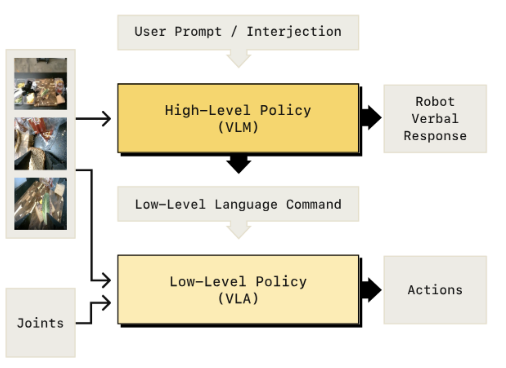
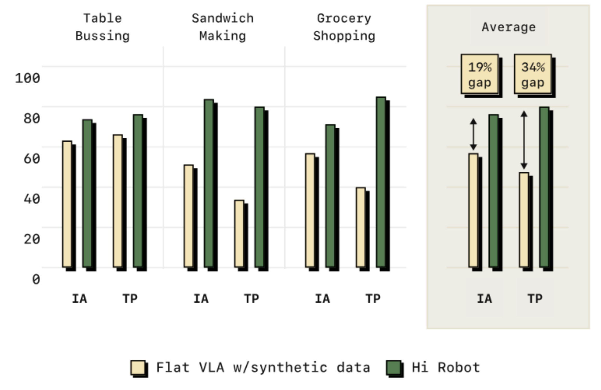

**Arxiv**: https://arxiv.org/abs/2502.19417
**Link**: https://www.physicalintelligence.company/research/hirobot

**The Challenge:**
- VLA’s lack the System 2 brain (little voice in your head that oversees your actions and helps you think through long horizon tasks).

**The Solution:**

- Formalize a hierarchical model that has two types of inference, one focused on long-horizon task planning and the other which focuses on low-level control for actions.

**The Technical Details:**
- High level policy (Sys2)  is a VLM that “talks with itself”, keeping track of the state of the task and prompting lower level actions to the VLA (Sys1).
- Sys2 model can operate at lower frequencies than Sys1 
- Sys2 model can dynamically incorporate user feedback via voice/text
- Higher-level inference runs at a frequency defined by either a) when user has new feedback or b) when sys1 is complete with its task
- Base model - PaliGemma 3B for Sys2 and π0 for Sys1
- Both models have essentially the same architecture, but the action head on Sys1 incorporates flow matching (diffusion)

- HiRobot outperforms flat-VLAs across a diverse set of home tasks. Significant work went into validation and test of this system against various other models/planning regimes.

**Limitations**
- Language as the interface between high-level/low-level policies is a lossy medium which may be better served by embeddings.
