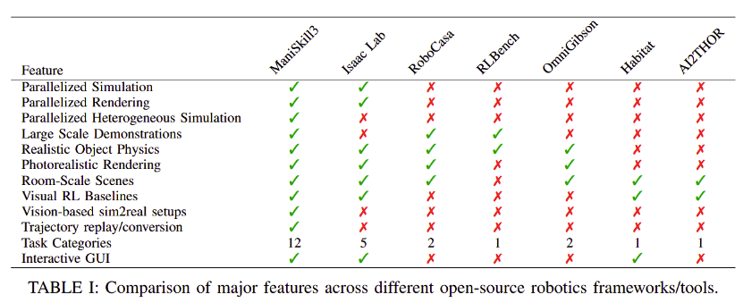
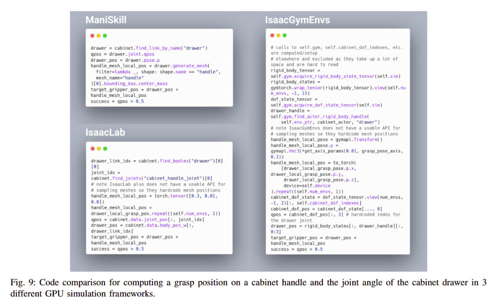
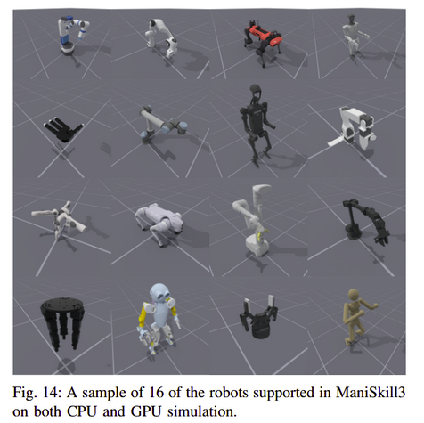
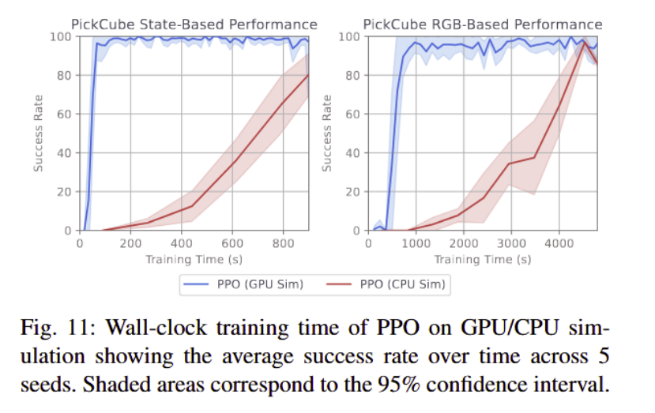

**Arxiv:** https://arxiv.org/abs/2410.00425  
**Link:** https://www.maniskill.ai/  

**The Challenge:**  
- General manipulation is a challenge in robotics thanks to lack of scalable data.  
- Current approaches consist of teleoperation (scalable, but limited) with imitation learning and offline training with RL for fine-tuning policies.  
- IL takes a lot of data that is expensive to collect but the RL approach is difficult to scale because of the amount of setup to get real world rewards and environment resets.  
- Simulation is the first thought solution to both issues, but is limited to a certain set of tasks and they “train too slowly to be practical” because they can simulate different envs at the same time, don’t render quickly when running in parallel, thus limiting scale..  

**The Solution:**  
- ManiSkill3 offers parallelized sim and rendering, a wide range of envs with 20+ robots, heterogenous sim, and development tools tor streamlined training and data generation

**Capability:**  
- GPU-parallel simulation + rendering using PhysX and SAPIEN, achieving > 30 000 FPS for visual tasks.  
- heterogeneous simulation: each environment can have unique scenes, positions, and object counts.  
- Python API for building, randomizing, and rendering environments  
- Integrates VR teleoperation (Meta Quest-based) for real-time demonstration collection  
- Enable sim2real + real2sim via digital twins. RL trained cube pick policies transfer to real robots with 90+% success.  
- Digital twin is 1:1 replica of a physical thing synchronized with movement and orientation.  
- Dataset generation pipeline with motion planning demos, imitation learning (RFCL, RLPD), and RL tools for scaling demonstration frames.  
- 20+ robots and 12 environments out of the box  
- Provide baseline implementations of PPO, SAC, TD-MPC 2, Diffusion Policy, ACT, PerACT, and vision-language policies (Octo, RT-X, RDT-1B).  

**Performance**  
- GPU sim + rendering has 2-3x lower memory use than IsaacLab and speeds up visual RL by 8-15x  
- Proximal policy optimization on PickCube task trains to 100% success in ~10 min (RGB input) vs > 1hr on CPU.  
- Sim2real cube-picking with domain randomization achieved 91.6 % real-world success across 24 trials.  

**Limitations:**  
- Ray-tracing rendering not fully parallelized; rasterization used for speed.  
- Soft-body and tactile sim still single-environment only.  
- Visual sim2real still requires green-screening and reward engineering.  
- Limited to static camera setups; no novel-view rendering yet.  
