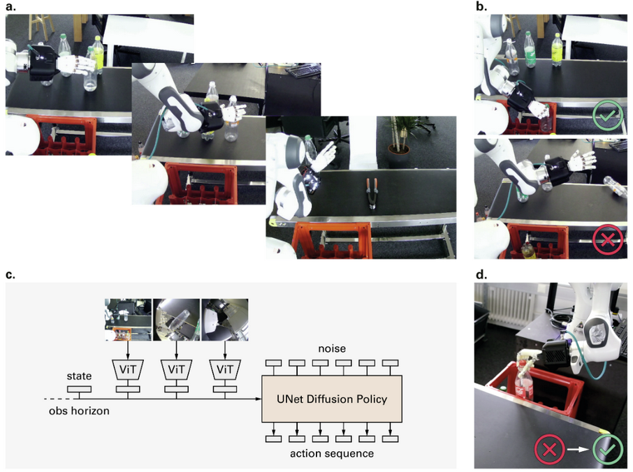

**Arxiv**: https://arxiv.org/abs/2506.11916  
**Link**: https://mimicrobotics.github.io/mimic-one/  

**The Challenge:**  
- Create robot policies that perform human-level dexterous manipulation in the real world, where current models fail to generalize and recover from small grasp or alignment errors.

**The Solution:**  
- The mimic-one team proposes a scalable method for training a diffusion based policy that learns directly from real world demonstrations and iteratively improves through targeted self-correction.
- They close the loop between teleoperation, failure analysis, and generative policy retraining producing high frequency and self correcting control.

**The Technical Details:** 

- **The Recipe:**
  1. Collect demos via teleoperation and label each success/failure.
    - Teleoperator intentionally introduces failures
  2. Train a UNet diffusion policy on proprioception
  3. Run the trained policy on the robot; log where it fails (missed grasp, misalignment, object slip)
    - Set the robot into those failure states and collect self-correction demonstrations showing recovery motions
  4. Retrain the policy including these correction episodes to teach recovery behavior
  5. Deploy the final policy at 15 Hz inference with continuous action sampling and observe emergent smoothness and re-grasping
- **Training the Diffusion policy**
  - Pretrain the perception encoder and train the UNet diffusion head end to end on real trajectories.
    - Inputs: 2-frame observation; proprioception + RGB from 3 cameras
    - Actions: Relative Cartesian end-effector poses + absolute joint angles (6D rotation representation)
    - Loss: Denoising MSE between predicted and ground truth action chunks

**Interesting Finds**
- Self-correction data increased task success by 26-33% across benchmarks (bread pick, bottle sort, battery insert).
- 1:1% increase of dataset size to success rate
- Ablations show all recipe elements are critical. The removal of relative actions, diversity, or correction drops success to 5–56 %.

**Limitations**
- Relies on teleoperator skill and real hardware access.
- Manual data collection and labeling remain costly.
- Policies are hardware specific and lack tactile sensing.
- Evaluations are single task rather than multi ask generalization.
