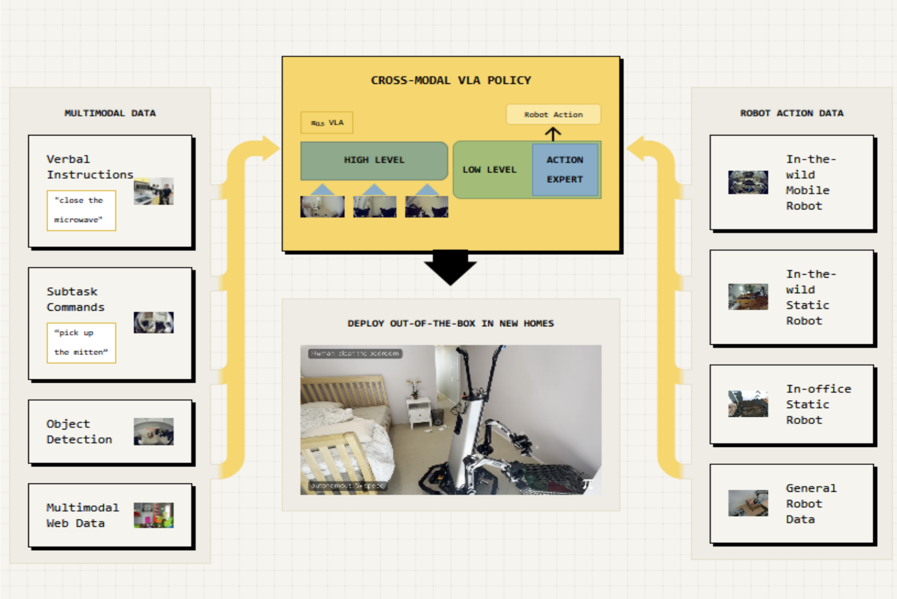
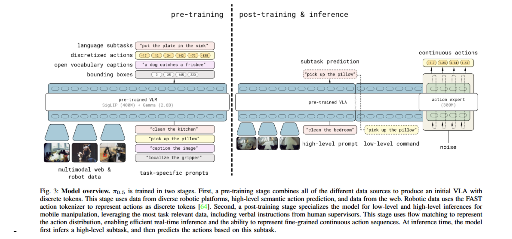

**Arxiv**: https://arxiv.org/abs/2504.16054  
**Link**: https://www.physicalintelligence.company/blog/pi05  

**Problem:**
- Generalization is the ability for a robot to be able to overcome new challenges in new environments in real time.
- At the low-level a robot has to understand the action, even if it's performing one from an unfamiliar perspective. Think picking up a dirty dish that’s teetering on a pile in the sink
- At the high level a robot must understand the semantics/context of the task as a whole. I.e. it must know what to do after it has washed a dish, or where to put out-of-place shoes, even in a new env/home

**Solution:**
- Physical Intelligence takes a large step towards higher levels of generalization by proposing an iteration on their π0 model, π0.5: (pi-oh-five), that focuses on performing trained tasks in entirely new settings. 
- “...goal is not to accomplish new skills or exhibit high dexterity but generalizing on new settings.”

**Technical Details:**

- π0.5’s largest improvements come from co-training the VLA on heterogenous, multimodal data
- This technique was used to teach the context of the scene, enable ‘thinking’ about the steps needed for a task, and cross-embodiment 

**The Model:**  
- PI trains a VLA model inputting text, actions, and images
    - Within this model, each data type is able to be encoded separately with different weights. Text goes through an embedding matrix; images are fed to a vision encoder; actions are projected onto a transformer space
    - All tokens in post-trained model use bidirectional attention as opposed to just causal
- Architecturally, π0.5 retains ideas from π0 using flow-matching to predict continuous action in the form of a flow vector field, but, as VLA training is faster using discrete tokens, π0.5 combines approaches.
    - First, the VLM uses autoregressive discrete tokens (FAST) to learn to map the actions from said input tokens fed to an autoregressive transformer
    - Then, in the post-training stage, the action expert learns to predict smooth, continuous trajectories through flow matching
    

**Training Recipe:**  
- Two stages:
    1) Pre-training: Inputs task specific prompts and multimodal web and robot data into a pre-trained VLM (Gemma +SigLIP) to produce an initial VLA
        - Input images, actions, and text is tokenized and fed autoregressively to the VLM.
        - Minimizes the following loss function:

            $$
            \mathbb{E}_{D, \tau, \omega} \left[ 
                H\left(x_{1:M}, f_\theta^\ell(o_t, \ell)\right)
                + \alpha \left\| \omega - a_{t:t+H} - f_\theta^a(a^{\tau, \omega}_{t:t+H}, o_t, \ell) \right\|^2
            \right]
            $$

            - The first term, \( H(x_{1:M}, f_\theta^\ell(o_t, \ell)) \), is the cross-entropy loss between the sequence of text tokens and the model's predicted logits, training the model to predict the correct action tokens based on its inputs (images, text, and state).
            - The second term, weighted by \(\alpha\), is the flow-matching squared error for the action expert, which compares the predicted correction vector to the ground-truth in action space. During pre-training, this term is not active (\(\alpha = 0\)).
    2) Post-training stage to special model for low/high level inference
        - This stage trains with next-token prediction instead of autoregressive
        - The second term is the flow-matching squared error that is used for actions
        - Breaking it down, w-a is the vector field that points from the ground-truth action sequence a to the noise sample w; the true correction vector
            - The next term is the output from the action expert; the models predicted correction vector.
            - Takes the difference between these two vectors and scales them by alpha.
            - This part now allows the model to understand correctness between predicted action sequence and correct action
        - The data used in this stage is successful mobile manipulator data (MM) and multi-env robot data for action prediction. Web data is kept to preserve semantic and visual capability, Verbal instruction demos are included to improve high level prediction
        

