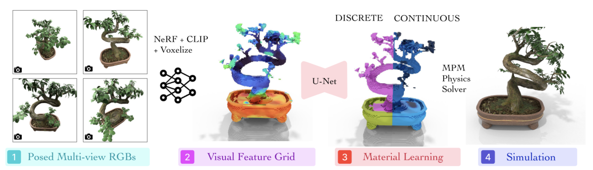

**Arxiv**: https://arxiv.org/abs/2508.17437v1  
**Link**: https://pixie-3d.github.io/

**The Challenge:**  
- Integrating physics into scene reconstruction is a manual and tedious process, limiting what we can do with pixel-perfect object reconstructions.  
- Previous methods include: identifying material properties for every object in the scene manually, or “differentiable physics solvers, iteratively optimizing material fields by comparing simulated outcomes against ground-truth observations or realism scores from video generative models” which are extremely compute intensive

**The Solution:**  
- “leverage rich 3D visual features such as those distilled from CLIP to predict physical materials in a direct supervised and feed-forward way. Once trained, our model can associate visual patterns (e.g., "if it looks like vegetation") with physical behaviors (e.g., "it should have material properties similar to a tree"), enabling fast inference and generalization”

**The Technical Details:**  

- Recipe  
  - 1) Take snapshots of synthetic object from multiple viewpoints to reconstruct a nerf (inject CLIP features for semantic context)  
  - 2) Voxelize the NERF into a NxNxNxD grid (where D is the CLIP dimension)  
  - 3) U-Net to predict material fields such as (Young’s modulus - stiffness, Poisson’s ratio - deformability, and density values)  
  - 4) Use MPM (Material-Point-Method) physics solver to simulate the object under various forces  

**Interesting Finds**  
- PixieVerse, a dataset with 1624 simulated objects was constructed in order to further this research  
- “Without any real-scene supervision, PIXIE can zero-shot generalize to many real-world scenes”

**Limitations**  
- Only operates on one object in a scene - extending this to multiple objects is for future work  
- “Another limitation is that while our UNet predict a point estimate for each voxel, materials in the real-world contain uncertainty that visual information alone cannot resolve (e.g., a tree can be stiff or flexible). A promising extension is to learn a distribution of materials (e.g., using diffusion) instead.”

