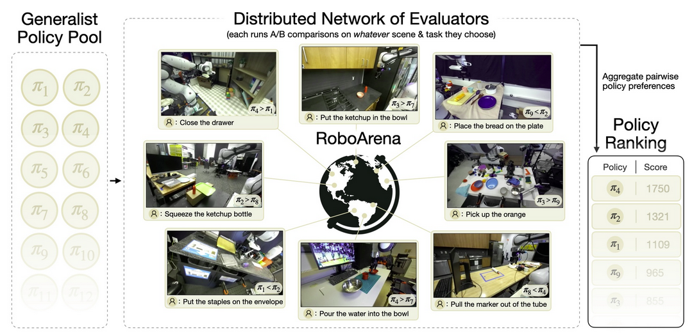
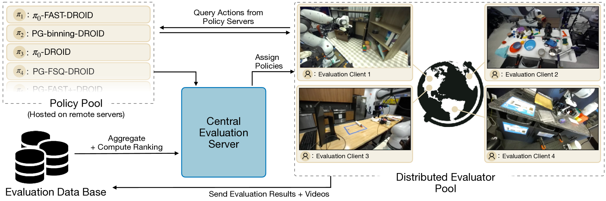
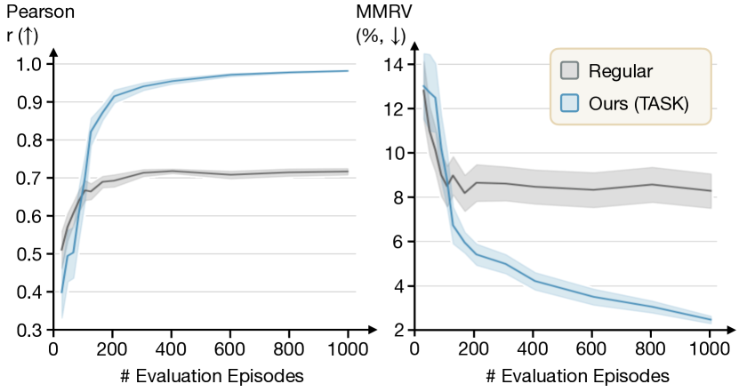

**Arxiv**: https://arxiv.org/html/2506.18123v1  
**Link**: https://robo-arena.github.io/  

**The Challenge:**  
- Many new generalist VLA policies are coming out thanks to heavy investment and quick development cycles.  
- Trying to find out which company’s policy performs the best is difficult to judge as existing evals lack diversity making it hard to understand how a policy might perform outside of specific actions.

**The Solution:**  
- RoboArena is the coming together of major labs and companies to democratize evaluation and increase transparency; crowdsourcing evaluation, vastly increasing task diversity

**The Technical Details:**  

- Process:
    1. Each evaluator gets two policies to execute both on the same scene/task setup (re-arranged freely) in a double blind test.
    2. For each policy the evaluator gives 3 grades: a progress score ([0,100] 0=no progress, 100 = successful execution), a binary preference (which policy the evaluator preferred), and a written explanation on which one was preferred and why.  
    3. ELO system for policies: the system aggregates many comparisons over many tasks/environments to compute global ranking of policies
    
    4. RoboArena then makes a policy report from the data it collects
        - VLM (GPT 4.5) categorizes  scenes and tasks
        - LLM (o3) uses info from the evaluations to create a policy report
        - Summarizes the strengths and weaknesses citing footage for evidence 

- **Algorithm 1: Policy Evaluation Protocol**
    1. **Input:** Set of policies $\Pi$, evaluator $E$, central server $C$
    2. **Output:** Global policy ranking, policy characteristics
    3. **For** $i = 1$ to $K$ evaluations **do**
        1. $E$ requests policies for evaluation from $C$
        2. $C$ samples two policies $\pi_A$, $\pi_B \sim \Pi$
        3. $E$ rearranges scene and defines task $T_i$
        4. $E$ executes $\pi_A$ and $\pi_B$ sequentially
        5. $E$ provides pairwise feedback $F_i(\pi_A, \pi_B)$ to $C$
    4. $C$ aggregates $\{F_i\}_{i=1}^{K}$ into a global ranking
    5. $C$ extracts qualitative policy characteristics 

**Notes**
- The system uses the DROID robot platform
- The LLM is fairly accurate with its reports 
- RoboArena comes to a fairly accurate ranking of a policy within 100 comparisons.

