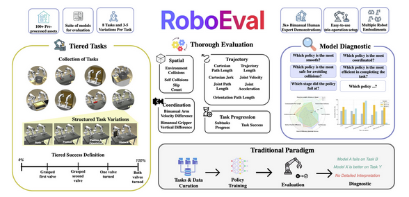
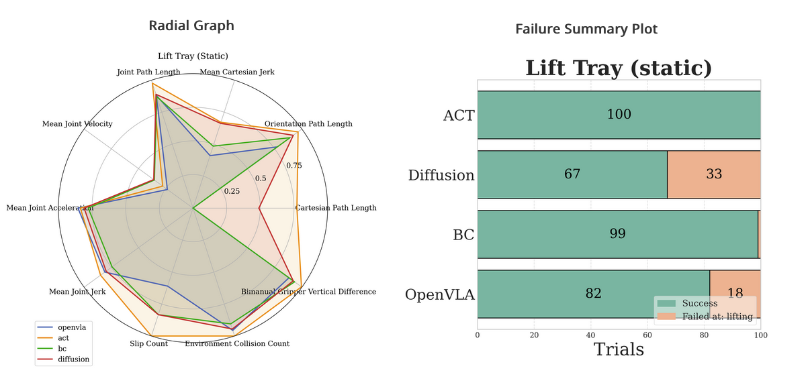
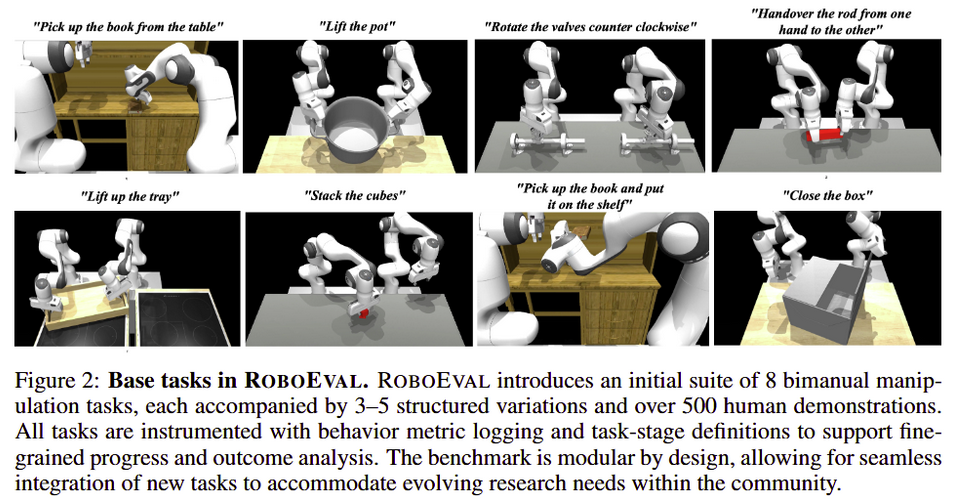

**Arxiv**: https://arxiv.org/pdf/2507.00435  
**Link**: https://robo-eval.github.io/  

**The Challenge:**  
- Robotics lacks in the benchmarking arena thus leading to slower progress and unreproducible comparisons compared to CV, NLP, and RL .
- Current benchmarks reduce performance to binary success; they don’t give insight into the policies behaviour, the reasons for success and failure, and the extent of the capability.

**The Solution:**  
- RoboEval is a sim benchmark that engages policies with different categories of tasks targeting specific skills (i.e. pushing, grasping, holding etc).
- It follows three design principles to give nuance to the evaluation of robotic policies: structured complexity, diagnostic interpretability (metrics that measure give insight into the policy’s behavior, and realistic supervision.

**The Technical Details:**  

- Series of 8 tasks, each having structured variations.
- “tasks are derived from common tasks that humans perform in diverse settings, from service style tasks such as lifting a tray, to warehouse tasks like closing a box, to industrial tasks like rotating hand-wheels”
- Policy is graded per task and variation [0,100] (partial credit awarded)
- Evaluation framework:
    - Metrics grouped by: 
        - Trajectory: path length, jerk, smoothness  
        - Spatial: self/env collisions, object slips  
        - Coordination: interarm height and velocity differences  
        - Outcome: level and overall success 
- Tasks span coordination classes (unimanual, loosely coordinated, tightly coordinated symmetric/asymmetric) 
- All evaluation automated
- Based on the evaluation, a model will spit out a diagnostic eg

**Interesting Finds**  
- When models achieved identical success rates, behavioral metrics exposed differences 
    - e.g ACT showed smoother motion and fewer slips than Diffusion Policy or OpenVLA

**Limitations**  
- Simulation artifacts and contact instability mess with realism
- Currently simulation-only; sim2real generalization not yet tested
