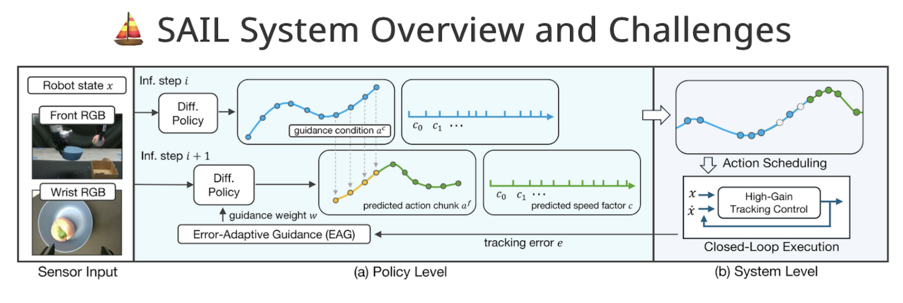

**Arxiv**: https://arxiv.org/abs/2506.11948  
**Link**: https://nadunranawaka1.github.io/sail-policy/

**The Challenge**
- Imitation learning/behavior cloning are currently latency-specific, meaning that system performance is tightly coupled with model inference speeds.
- We notice that if the model inference speeds change (as a function of gpu changing, or hardware changing), that policies become very stilted/jerky.
- Optimizing inference speeds to be faster might actually lead to decreased model performance because our system learned actions on the slower model.
- The same holds true for adjusting controller-specific parameters.
- The fundamental challenge this paper addresses is decoupling model inference speed from control.

**The Solution**
- Train the policy to predict action targets that are decoupled from our controller + adaptively schedule future actions to merge smoothly with previous outputs.

**The Technical Details**
- Classifier-Free Guidance (CFG) is typically used to condition next action-predictions on the previous planned sequence (think merging multiple predicted trajectories smoothly over time).
- However, during high-speed execution this fails when the robot does not follow the predicted action path perfectly (as many robots do).
- Since the trajectory the arm actually follows differs from the merged trajectories, we are left with jerky movements the arm must take to get back on track.
- Error-Adaptive Guidance (EAG) solves this by integrating the actual reached-pose into the policy, as opposed to just the commanded trajectory.
- Adaptive-Speed Policy Execution is another improvement of SAIL, which slows the controller down during situations which require increasing dexterity (using DBSCAN clustering to identify those moments).
- This enables the model to give increased inferences per timestep to the controller during complex tasks.

**Limitations**
- Increasing robot dexterity at speed leads to failures like inadvertently throwing can at high speed (model can predict its own observation-action drift, but a hard time learning the dynamics of the world at higher speeds)
