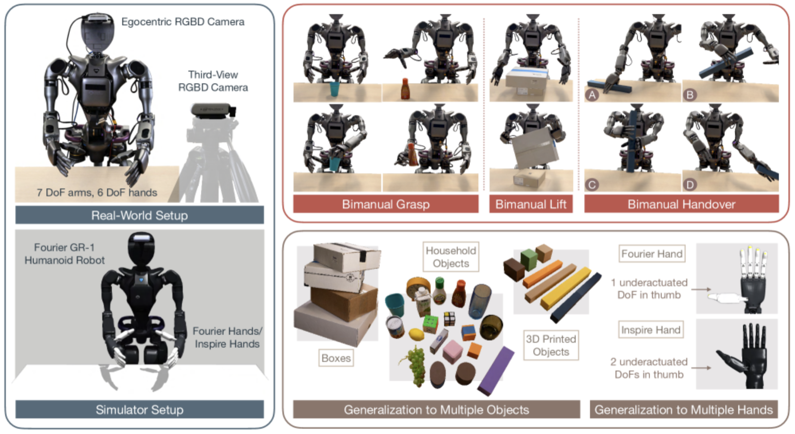
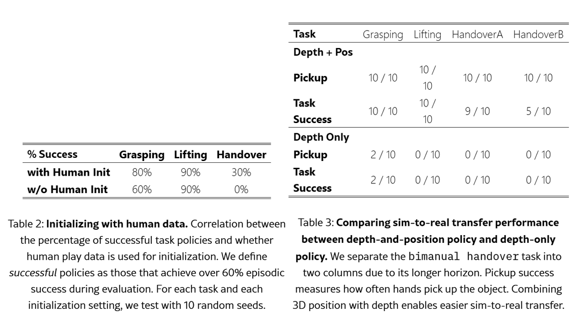

**Arxiv**: https://arxiv.org/abs/2502.20396  
**Link**: https://toruowo.github.io/recipe/  

**The Challenge:**
- Low cost humanoid hardware (“lightweight noisy motors and underactuation” make it hard to transfer to simulation
- Designing a reward function that captures bimanual tasks (e.g. handover, lifting) requiring precise timing, motion, and complementary hands is hard
- RL is hard in long-horizon bimanual tasks
- “ In robotics — and especially in dexterous manipulation — designing effective, generalizable rewards becomes a key challenge due to complex contact dynamics and object variability”
- Objects are quite diverse in the real world, making training models with various shapes/materials in the sim with purely pixel-based policies difficult

**The Solution:**
- Automated sim2real tuning (autotune module) 
- Use contact stickers to mark objects and show “good” hand positions. The robot gets reward when it lands on those stickers and when the object moves closer to the goal (move in sync + at the right spots)
- Task-aware initialization is like giving the model a seed training with human poses. Train separate policies for grasp, handover, and lift and then merge them into a generalist one
- “the sub-task policies act as “teleoperators” in the simulation environment, and the centralized generalist policy learns from curated data.”
- Hybrid object representation balances low and high dimensions

**The Technical Details:**
- “For instance, a bimanual handover can be segmented into: (1) one hand contacting the object, (2) lifting the object near the second hand, (3) the second hand contacting the object, and (4) transferring the object to the target location. We therefore define rewards based on two key components: “contact goals” encourages the fingertips to reach task-relevant contact points on object, and “object goals” penalizes current object state deviation from the target object state (e.g. xyz position).”
- Fourier GR1 humanoid; two 7-DoF arms; multi-fingered hands. NVIDIA Isaac.
- In sim, many objects are just cubes/cylinders/spheres with randomized mass/friction/size. It teaches how to grab in a generalized way instead of memorizing on the actual object

**Interesting Finds**

**Limitations**
- Still very far from anything you can do with human hands
- Robot hands have fewer active joints than humans
- Improve via task demos from tele-op, different low level control like torque, and faster perception loops

Used GPT to explain the spectrum of object representations in a table below:

| Representation | What it is (simple picture)                                                                     | Strengths                                                         | Weaknesses                                                                | Real-world examples                                     |
|----------------|------------------------------------------------------------------------------------------------|--------------------------------------------------------------------|---------------------------------------------------------------------------|---------------------------------------------------------|
| 3D Position    | A single dot showing where the object is in space (x,y,z).                                      | Super simple; easy to use; good for knowing “where to grab.”       | Doesn’t tell you which way the object is facing or its shape.             | Warehouse robots picking boxes; drones locating landing spots |
| 6D Pose        | A dot plus arrows showing both where the object is and how it’s rotated (x,y,z + roll,pitch,yaw).| Lets robots place and orient objects exactly (like putting a Lego block in the right slot). | Hard to estimate in messy scenes; doesn’t work well with squishy/bendy objects. | Car factory robots placing doors; surgical robots aligning tools |
| Depth          | A gray map where brightness = distance (closer = lighter, farther = darker).                    | Shows shape without caring about colors; works in the dark.        | Confused by shiny or see-through objects; only sees the side facing the camera. | Xbox Kinect games; robot vacuums detecting furniture     |
| Point Cloud    | A cloud of dots floating in space that together form the object’s shape.                        | Detailed 3D structure; great for mapping or planning paths.        | Heavy to process; can be incomplete or messy if things block the view.    | Self-driving cars with LiDAR; drones scanning buildings  |
| RGB Images     | A regular photo with red, green, blue colors like your phone camera.                            | Full detail of color and texture; can use big AI vision models.    | Lighting changes mess it up; doesn’t directly tell the robot the 3D shape.| Quality control cameras on assembly lines; store robots checking shelf stock |

