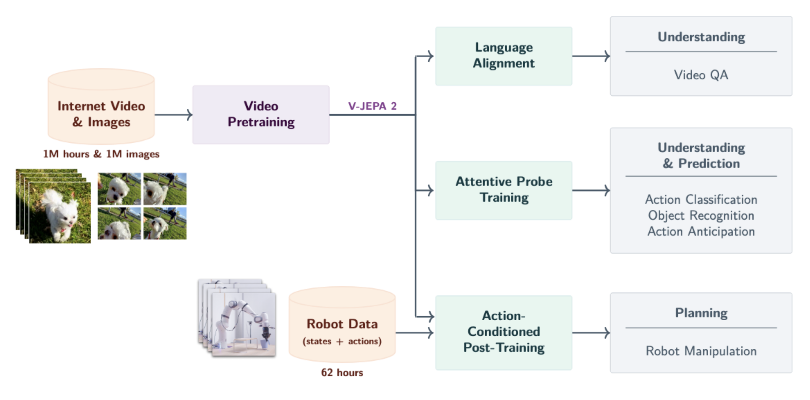

**Arxiv**: https://arxiv.org/abs/2506.09985  
**Link**: https://ai.meta.com/vjepa/

**The Challenge:**
- Zero-shot robot control in new environments

**The Solution:** 
- utilize large internal datasets to precondition model with information about the diverse world, and gain fine-grained control over the arm with a tiny subset of robotic interaction data

**The Technical Details:**

- Recipe
    - pre-train an unsupervised action-free model that predicts next frame embeddings in videos
    - fine-tune on VQA tasks to align with language
    - post-train on a tiny dataset of action/video pairs in a single environment
- 62 hours of unlabeled robot interaction data + 1 million hours of curated internet video
    - Over 22 million unique video clips
- The pre-training goal was for the model to predict masked embeddings in patches of images/videos that were randomly dropped. 

**Interesting Finds:**
- Scaling laws 
    - 2m-> 22m videos = +1.0%
    - 300m->1b param = +1.5%
    - 90k->252K iter     = +0.8%
- Probe-based Action Anticipation is an implicit bias encoded into the pre-training phase which teaches the model to predict future actions given a contextual video (ie a human about to open a door). The goal was to give the model priors on knowing when it should perform certain real-world actions.

**Limitations**
- Sensitive to camera positioning - needs to see robot base from all angles of action for implicit hand-eye calibration
- Long horizon planning is difficult with autoregressive models due to error accumulation 
